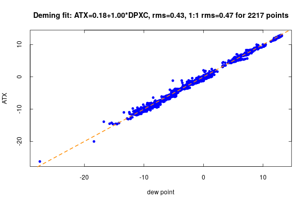
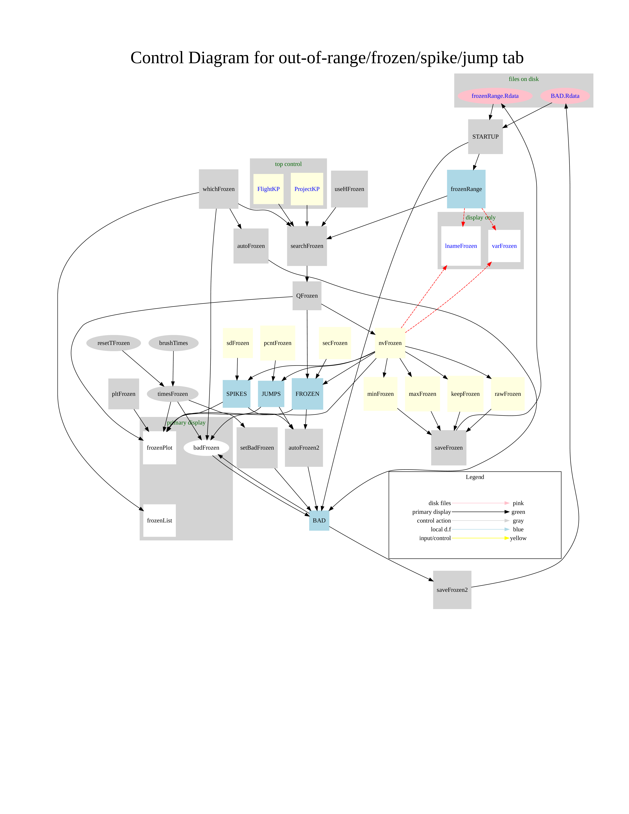

\newpage


```{r initialization,echo=FALSE,include=FALSE}

require(knitr)
opts_chunk$set(echo=FALSE, include=FALSE, fig.lp="fig:")
opts_chunk$set(fig.width=6, fig.height=5, fig.align="center", digits=4)
thisFileName <- "QAtoolsUserGuide"
require(Ranadu, quietly = TRUE, warn.conflicts=FALSE)
require(ggplot2)
require(ggthemes)

```

# Introduction

## General scope

This manual describes a "Shiny app" named "QAtools" that is
intended to facilitate the review of data from new flights of the
NSF/NCAR/EOL/RAF research aircraft. (NSF=National Science Foundation;
NCAR=National Center for Atmospheric Research; EOL=Earth Observing
Laboratory; RAF=Research Aviation Facility), presently a C-130 and
a Gulfstream V. The objective of this tool is to support quality assurance
during research projects and during subsequent processing of data
from those projects. The underlying scripts read the netCDF data archives
produced by the processing program "nimbus", which reads the data
files recorded by the data systems on the research aircraft and converts
the digital information to engineering-unit output. Nimbus is described
[here](https://www.eol.ucar.edu/content/processing-software).
The QAtools app can also help analyze past projects. (For a list of
recent projects, see at [this EOL web page](http://www.eol.ucar.edu/all-field-projects-and-deployments/);
data requests can be made via links on that page.) However, the data
archive used here is a different one, mostly matching that available
on EOL storage under "/scr/raf\_data". These files often contain
variables not present in the final production files, including housekeeping
and redundant measurements, so they provide additional information
for the assessment of data quality. That working repository is duplicated
in part on the server that supports QAtools, and new files must be
transferred to that cloned repository.

## What is a "Shiny app"?

A "Shiny app" is an interactive web application based on the "shiny"
package for R. The routines and data files reside on a server and
can be accessed either locally or remotely as a web page. See 
[https://shiny.rstudio.com](https://shiny.rstudio.com)
for complete information. A very cursory tutorial is also included
in the QAtools package, as described below. The QAtools Shiny app
is accessed at this URL (temporarily installed on the RAF ground station,
so this address may change in the future): [https://128.117.84.138:3838/QAtools](https://128.117.84.138:3838/QAtools).
This is presently inside the UCAR firewall so if you are outside you
need to use VPN. When the ground station is at a remote location for
a field project, the URL will be different.

## The reference repository

The code for this Shiny app resides on GitHub at 
[this URL](https://github.com/NCAR/aircraft\_QAtools.git).
However, a complete installation requires downloading several other
GitHub repositories also, as described in Appendix A.3 to this User
Guide. The "Ranadu" package (available at [this URL](https://github.com/NCAR/Ranadu.git))
is used extensively and must be installed on the Shiny server that
supports QAtools. Other required R scripts are also on GitHub. See
the appendix for details regarding installation.

\newpage

# Outline of the General Structure

The basic structure of QAtools features multiple layers of tabs, each
supporting a different analysis tool. The top level includes these
tabs:

## Guide 

This tab
duplicates the summary information in the paragraphs below, for quick
reference.

## Background information 
This section
includes two main topics, the "Suggested checks" tab that provides
guidance on a possible sequence for using this tool for various variables,
and the remaining tabs that contain tutorial or training material.
The latter will not be part of normal use of this tool but may be
of interest because they develop some recommendations that are not
conventional.

## Past Projects
This tab provides
access to compilations of measurements from past projects that can
aid in the assessment of problems. For example, the flight-dependent
and project-dependent comparisons between ATX and AT\_A, QCXC and
QC\_A, and PSXC and PS\_A will give some guidance regarding what tolerance
is expected, and differences among available INS outputs can help
determine what range to expect in future projects. The available tests
also include comparisons between measured profiles and those expected
from the hydrostatic equation. The latter provides for independent
prediction of pressure from temperature or temperature from pressure,
and so is a useful test based on independent measurements.

## Tools
Some tools for calculating
new variables, for fitting, and for transfer of measurements to other
analysis programs are provided by secondary tabs under this tab. The
first supports calculation of a new variable to be added (temporarily)
to a data file so that it can be used with other analysis tools in
QAtools. This tool can be used with the "ShiftInTime" function
to generate new variables with different time shifts, or to apply
filters to variables. There is also a "lm fit" tab that supports
fitting of functional relationships (e.g., polynomials) to data in
the netCDF files, e.g., as is needed to determine empirical coefficients
for representing angle of attack in terms of BDIFR or the static pressure
correction in terms of the measured pressure and dynamic pressure.
The last tab on the right supports examination of measurements in
external programs like ncplot, Xanadu, python, etc. An advantage is
that the working file with any added variables but without undesired
variables can be transferred to those other programs.

## Review
Review plots have been generated
automatically for some recent projects using an R script. The implementation
here supports those same plots, but with the added capability to work
interactively by, for example, selecting subsets in time or adding
new variables to the plots. This is a core capability of QAtools and
will often be the best starting point for review of data from a flight.
Indications of problems then can be explored using other parts of
QAtools.

## Known Problems
This tab includes
several checks for common problems. There is a tab to help search
for dewpoint-overshooting problems, one to use periods when in cloud
to test for agreement between the temperature and measured dew point,
one to search for variables that are outside normal ranges or are
frozen or have spikes, and one to assess if the cavity pressure in
the dewpoint instruments has changed from that expected on the basis
of earlier projects.

## Special Processing
This last tab
supports processing runs to add some variables to the archive files
that represent processing with a Kalman filter (for wind), alternate
calculation of the vertical wind based on a new representation of
the angle of attack that has been discussed and evaluated but not
yet implemented in routine processing, a third tab to represent recalculation
of the alternate AKRD representation, and a tab to add variables representing
the elevation of the surface below the aircraft and the altitude of
the aircraft above the surface to the standard files. These are not
intended for routine processing, for which there are stand-alone scripts;
rather, they are intended to allow inspection of the results to determine
if such separate processing is desirable.

\newpage

# Suggested Usage (emphasizing the "Review" tab)

## First-pass review

### Overview

The suggested starting point for quality review is the "Review"
tab (the fifth tab in the main window). This is an interactive interface
to a set of plots that cover a standard set of variables. Cycling
through these plots can check quickly for unusual behavior so that
potential problems can be identified and then investigated further
by other means. The default tab in the lower right panel is "plot"
but there are other choices also, as described in more detail below.

### Normal use

Once the project and flight have been defined (as described below),
normal use will consist of these steps:

1. Cycle through the available plots using the "plot" numeric-input
slot and note potential problems that may need further investigation.
The plot number can be changed in three ways:
    + Select the displayed number by sliding the mouse cursor over it, then
type the new number.
    + Click the cursor in the entry slot, then use the up-and-down arrow
keys to increment the number. This is often the best choice because
the cursor can be left in the entry slot while you step through the
plots.
    + There are small arrows in the entry slot that also can be used in
the same way.

2. Alternately, if you want to proceed to plots for a specific type of
variable, like the wind, you can use the "plot class" menu in
the left sidebar to jump to those plots. Many plot classes contain
multiple plots, so this is a way to find the plots pertaining to a
particular class of variable. Once at the first plot in the class,
the methods in the item above can be used to step through that class.
  
3. You may want to refine a particular plot in the following ways:
    + Select a subset time interval. This can be done by "brushing"
the left-mouse button over the desired time interval in the lower
right-panel plot; i.e., hold it down while moving over the desired
time range. To reset, use the F4 key\footnote{On some Windows systems use Fn with F4.}
or double-click in the displayed plot. Alternate ways of selecting
the time interval are discussed under the "time range, restrictions"
section below.
    + Apply restrictions, for example by only considering temperature measurements
when the airspeed is above some threshold to avoid approach and during-takeoff
measurements. This is described in the "time range, restrictions"
section below.
    + Select a subset of the ordinate range. The "brush" function will
reset both the ordinate range and the time interval if the "brush
for ordinate?" checkbox below the plot-class menu is selected.\footnote{The default is for this checkbox not to be selected because for most
plots an appropriate ordinate scale is automatically selected when
a subset time interval is selected.}
    + Add or remove variables from the plot. You can do this by CNTL-left-mouse
clicking the variable name in the left-panel "variables" menu
to add or remove it, or by left-mouse clicking on a variable to select
it only. The available variables for each plot are defined in a configuration
file for the project. If you want to add some other variable to the
plot, use the "add var" dropdown menu near the top right of the
window. If you want to plot something else, you can also use the "extras"
plots at the end of the plot sequence, which support customizable
plotting of any variable in the netCDF file.

There are detailed descriptions of the standard plots in Appendix
A.1, and a description of how to set up the plots for a new project
is included in Appendix A.2.

## Additional details regarding use of the "Review" tab

The following discusses all the controls available in the "Review"
tab. Many of these won't be needed during normal use.

1. The top panel, extending across the display below the top tabs, has
two options controlled by the tabs at the left side, either "project,
flight, and plot" or "time range, restrictions":
    + The "project, flight, and plot" tab has controls for
selecting the desired project, the flight, and the plot number. The project
is selected using the drop-down menu at the top left of the sub-panel,
and the flight and plot number are determined by numeric entries into
the "Flight" and "plot" entry slots. To change the latter
two, select the entry and then type a new entry or use the other methods
described in the first item under "normal use" above. There are additional
checkboxes that allow selection of research flights, test flights,
or ferry flights (respectively, "rf", "tf", "ff"). There
are also buttons for the following functions:
      -  "save config" to save any reconfigured plots where, for example,
you have changed the displayed variables. Use this with consideration
for other users because the change is saved in the configuration file
for the project and so will affect everyone using this tool. This
is intended as an aid during initial setup of the configuration.
      -  "PDF" and "PNG" buttons that save all the plots in PDF or
PNG format. The plots observe the selected time interval but only
apply the "restrictions" if the "apply restrictions" checkbox
in the sidebar is selected. It takes about a minute to generate either
set of plots and the app will not respond until finished. When running
on a Shiny Server, these will be written to the "QAtools" directory
on the computer hosting that server. In the case of the "PDF"
button, they are displayed in a new browser window where they can
be downloaded and saved. For the PNG button, they are saved in the
directory "QAtools/PNG" which is not normally accessible, although
if running from the groundstation those files are in the /home/ads
file directory. For single downloads, the displayed files in the "Plot"
display can be saved by right-clicking on the image and selecting
"save image as ...". 
      - The "R" button saves the R code used to generate the plot. This
may be useful if it is desirable to tailor the plot in some way for
specific uses beyond data review.
      -  The "quick" button displays a list of all available variables
and provides a pop-up time plot of the variable(s) selected.
    + The "time range, restrictions" tab provides a slider control that can
be used to select subset time intervals. The selection applies to
all plots, not just the time-series plots. The two ends of the slider
can be moved by left-mouse-clicking on them and holding the click
to slide them. There is a "rst" button that resets the display
to the full range. The "F4" key or double-clicking in the plot
also resets the time range and, if modified, the ordinate range. Four
additional numeric-input slots at the right side of this panel can
define limiting values for the minimum airspeed, the maximum absolute
value of the roll, the minimum altitude, and the maximum rate of climb
of the aircraft. These restrictions are only imposed when the "apply
restrictions" checkbox in the middle of the left-sidebar panel is
selected. They can be used to eliminate turns, periods near takeoff
and landing, low-level flight, and rapid climbs and descents, for
example to obtain more representative average values of the vertical
wind.
2.  The next section of the plot, below the preceding panels, is divided
into two parts:
    +  The sidebar control panel, containing the "plot class" menu that
can be used to jump to particular sequences in the plots, the "apply
restrictions" checkbox that applies the restrictions defined in
1(b) above, a "brush for ordinate?" checkbox that includes ordinate-range
selection in the brush function that resets plot limits, a "variables"
menu that supports changing the plotted variables and shows those
being used, and a set of additional buttons at the bottom. Two of
those activate other programs (ncplot or Xanadu) with the variables
that are being used, but these may not work if the corresponding program
is not installed on the system supporting QAtools and in any case
will not work for the shiny-server version of this program. The "see
maneuvers" button uses a set of tests to search for standard maneuvers
like the pitch or circle maneuvers and lists any that are found to
the RStudio console if that is how QAtools is being run; these won't
be seen if a shiny server is supporting QAtools. The last button displays
a copy of this User Guide.
    +  The main display panel, the right-bottom panel, shows the selected
plot. At the top of this panel are another series of tabs, "plot",
"stats", "histograms", "soundings", and "listing".
The "plot" tab is the default and the tab that will be used during
normal use. The other tabs show the same variables in the main plot
but in other formats, which may be useful for special cases. All these
obey the restrictions imposed by the time range and, if "apply restrictions"
is selected, by the defined restrictions.

### General expectations for the plots

Appendix A.1 provides more detail regarding the expected appearance
of the plots.

## Background -> Suggested checks

The next suggested step is to go to the "Background" tab and select
the "suggested checks" tab. This provides some recommended steps
for variable-dependent tests that won't be repeated here. Suggestions
are available under tabs labeled "PSXC/QCXC", "ATX", "humidity",
"INS performance", "WIC", "WD/WS", and "LWC and particles".
Many of these suggestions relate to comparisons to expected performance
as seen in past projects and use the "Past Projects" tab, while
others relate to the "Known Problems" tab. Items under these tabs
will likely continue to develop as new tests are constructed.

\newpage

# Detailed Descriptions of Other Key Tabs

## Past Projects

### General intent

This tab provides a series of functions that support comparisons to
expected behavior of measurements based on past projects. For example,
throughout the history of the GV the "PS\_A" measurement of ambient
pressure has shown a consistent relationship to the best values of
the research-system measurement PSXC, so checking that the same relationship
applies to a new project is a good test of the validity of the measurement
PSXC. Similar comparisons can be made to several other measurements
using the tabs in this section. Each tab is described in some detail
in the following sections. These descriptions will likely be easier
to follow if you look at an example while reading them. A good suggested
flight to view is CSET flight 7.

### PSXC

There are two lower-level tabs under this one:

1. *"Compare to PS\_A":* This tab generates two plots for
the selected project and flight (or, if the "ALL?" checkbox is
checked, for all flights in the project:
    + The left plot is a histogram of the difference between the measured
pressure PSXC and the pressure determined from PS\_A by a fit to historical
data. In this case, the fit for the GV is  
$$PSFIT = c_{0} + PS\_A*(c_{1}+c_{3}*PS\_A)+c_{2}*QC\_A$$  
where $c_{\{0-3\}}=\{-2.624, 1.00631, 0.016021, -4.6658e-06$.
This gives a fit to past measurements that has a standard deviation
from those measurements of only about 0.2\ hPa, which is smaller than
the uncertainty limit for this measurement, so this is a stringent
test. The mean and standard deviation shown above the left plot will
usually be about 0.2\ hPa or smaller for good measurements. There
is an analogous but different fit for the two pressure variables from
the C-130 (PSFDC and PSFC).
    + The right plot shows mean and standard deviation for the difference
between PSFIT and PSXC for bins in PSXC, and so tests for altitude
dependence in the representation of PSXC. The numbers along the right
side of the plot show the number of 1-Hz measurements used for each
bin in PSXC. Where the numbers are small, the results may be unreliable
because they may result only from rapid climb or descent through those
levels. For the C-130, the points with error bars show PSFDC and the
green line shows PSFC.<br>
There is a "Help info" button that will pop-up a description of
what to expect for these two plots and will show an example. Dismiss
that pop-up using the "Dismiss" button or by clicking anywhere
in the main window.

2. *"hydrostatic-eq check":* The hydrostatic equation expresses
a relationship between changes in pressure, temperature, and height,
so with low-uncertainty measurements of height from a GPS receiver
that equation can be used to predict pressure from temperature or
temperature from pressure during climbs and descents. In this case,
the prediction is for pressure under the assumption that the temperature
(ATX) is correct. That leads to the plotted lines vs.~altitude that
show the difference between the measured pressure and that predicted
from integration of the hydrostatic equation. The blue line is the
prediction, and the two red lines show limits that would result if
the temperature is adjusted by $\pm0.5^{\circ}$C. An offset often
arises at low level, conjectured to arise from the slow time response
of the temperature sensor during rapid climb, and this often produces
an offset of 2~hPa or so in the integrated pressure. Once above the
lowest levels, the offset should remain reasonably constant. The "All?"
checkbox does not apply to the hydrostatic-equation check because
only the first climb is used for the calculation. <br>
Here also, there
is a "Help info" button that provides an example of expected behavior
and some guidance regarding how to interpret this plot.

### QCXC

The displays here are analogous to the "Compare to PS\_A" plots
above, but for QCXC as compared to QC\_A. No comparison to a hydrostatic-equation
prediction is possible for QCXC, so there is only one pair of plots
generated under this tab. See the "help info" button.

### ATX

Under the "ATX" tab, there are three lower-level tabs:

1. *"Prediction from AT\_A":* The relationship between AT\_A
and the best research temperature has been reasonably consistent in
recent projects, although there are some significant differences (esp.~at
low temperature). This relationship has led to a regression prediction
of ATX from AT\_A that can be used to check if the recent consistency
continues to hold for new projects. The two plots generated under
this tab are a histogram of the difference between the predicted and
measured ATX and a plot showing that difference in bins of PSXC, to
check for an altitude dependence. As for the above histograms, the
numbers at the right side of the plot show the numbers of 1-Hz measurements
in each bin, and bins with a small number of measurements may have
anomalous errors arising from rapid climb or descent through those
levels. As for other items in the "Past Projects" tab, the "Help
info" button provides guidance regarding interpretation of this
plot and a sample plot, so that information is not repeated in this
User Guide.

2. *"Comparisons among ATs":* Because there are usually
redundant measurements of temperature available, it is possible to
check for problems by searching for disagreements among those measurements.
CTRL-left-mouse click on the displayed variable menu to select two
to compare. {[}XXX multiple pairs do not display correctly yet.{]}
The plot shows the mean and standard deviation of the difference in
bins of temperature to illustrate how the differences vary across
the range of measurements. Difference significantly larger than 0.3$^{\circ}$C,
the expected uncertainty in temperature, may be indications that the
discrepancy should be investigated further. Two exceptions are the
"normal" tendency of AT\_A or AT\_A2 to be higher than ATX at
low temperature and the tendency of ATH2 to be systematically about
0.5$^{\circ}$C lower than ATH1 for temperatures around -60, perhaps
because the recovery factor is not represented correctly for ATH2.

3. *"hydrostatic-eq check":* This test is like the hydrostatic-equation
prediction of pressure from temperature above, except that the pressure
is assumed to be correct and the temperature vs height is deduced
by integrating the hydrostatic equation. Whereas a profile is required
to predict pressure from temperature, the temperature at individual
points can be predicted from the change in pressure with height, so
entire flights or entire projects can be used for these plots. See
the "Help info" button for more information on the data restrictions
used and the specific form of the hydrostatic equation. Difference
exceeding the claimed temperature uncertainty of about 0.3$^{\circ}$C
may be indications that further study is needed. For example, this
plot for ORCAS suggests a systematic error of up to 2$^{\circ}$C
at the lowest temperatures (with ATX too high), so this suggests further
investigation of this possibility.

### INS/IRU comparisons

The two lower-level tabs under this tab show histograms (with mean
and standard deviation) for the difference between pitch and roll
measurements from redundant INS units and for the difference in heading.
These are potentially useful for determining project-dependent offsets
to use in the "Configuration.R" file for the "Review" tab.
Offsets may vary among projects, but the standard deviations should
remain small compared to 0.05$^{\circ}$, the expected uncertainty
limit quoted for the inertial navigation systems. Larger numbers may
indicate deterioration of performance for one of the units being compared.

### Maneuver study

This tab has several lower-level tabs:

1. *"search for maneuvers":* This tab has a series of checkboxes
for the various types of maneuver and a "search" button to search
for maneuvers. *For existing projects, this search should not
be used in most cases because sets of maneuvers have already been
compiled and edited, and using this search button will overwrite the
existing set of maneuvers.* If you click this button, a warning will
ask if you really want to overwrite the existing file. Normally this
should be done only for new projects. The search covers all available
flights for the selected project, including test and ferry flights,
and will take a few minutes. A notice "search in progress" will
appear at the bottom right of the display window, and you should wait
for that message to disappear before continuing.

2. *"Speed Run":* Under this tab, the available speed runs
for the selected project will be displayed at the top left. Select
one of the checkboxes to see that speed run (if any are displayed).
You can click the "Info" button to see more information about
speed runs and the use of this tab.
Three plot formats are available:
    + "recovery factor": This plot shows the measured recovery temperature
RTX as a function of $V^{2}/(2c_{p})$ so that the slope corresponds
to the recovery factor for the temperature sensor. The fitted slope
is listed at the top of the plot, as the second fit coefficient. The
response time of the temperature sensor often produces two distinct
lines, one while the airspeed is increasing and another for decreasing
airspeed. The "set delay" slider makes it possible to delay the
RTX measurement, and introducing a delay of around $-1500$ -- $-2500$\ ms
often reduces the scatter in this plot (as reflected in the displayed
value for the "rms". For good speed runs, values around 0.99 for
the recovery factor are expected for RTH1.
    + "angle of attack": The second plot that can be selected using
the "type of plot" dropdown menu shows the angle of attack (AKRD)
along with the value AOAREF expected if there is zero wind. A fit
represented by $AOAREF=c_{0}+c_{1}(ADIFR/QCF)$ has the coefficients
shown at the top of the plot. Typical values of these coefficients
vary among projects but are often about 4.4 and 21. If AKRD and AOAREF
differ significantly, either conditions are poor for the speed run
(perhaps with real vertical wind on nonuniformity of temperature)
or the empirical representation of AKRD may need re-evaluation.
    + "airspeed dependence": The last plot supports display of variables
as functions of airspeed during the speed run. Portions while the
airspeed is increasing are shown as green dots, while portions with
decreasing airspeed are shown as red dots. This display is often the
best way to determine the time constant of sensors, because for linearly
increasing or decreasing airspeed the offset is equal to the time
constant. Introducing a delay to minimize the difference between the
two sets of dots in the plot (as represented by the rms) is a good
way to determine that time constant. This often indicates a time constant
for RTH1 of about 2.3~s, although that may vary with the air density
at the flight altitude. The dropdown menu "other variable" provides
choices of other measurements so that the same can be used with any
airspeed-dependent measurement.

3. "Pitch": The pitch maneuver is used primarily to test
the immunity of the vertical-wind measurement to aircraft vertical
motion. Some additional information can be viewed by clicking on the "Info"
button. The displayed plot shows three time-series lines, for PITCH,
ROC (rate of climb), and WIC. The blue line indicating PITCH can be
used to determine where the pitch-maneuver lies in the displayed time
interval. During that maneuver, it is desirable that there be no correlation
between ROC and WIC as would be expected if the aircraft motion does
not affect the measurement of vertical wind. 
    + A time-slider control can be used to set two time intervals, one for
the "environment" (which is best set to include times near the
pitch maneuver when the pitch and vertical wind are steady) and a
second for "pitches" that should be set to include only the pitch
maneuver. (These can be set by "brushing" along the time-series
plot with the appropriate choice, environment or pitches, selected.)
An additional cyan line is plotted along the bottom of the plot to
indicate the region selected for the pitches. The reason for these
selections is that the standard deviation of WIC in the region selected
as the environment (excluding the "pitches" region) can be compared
to the standard deviation during the pitches. If there is no effect
of the aircraft motion, it is expected that these will be equal. Both
are listed at the top of the plot. In addition, a "transmission"
expressed in percent is calculated by finding the maximum value of
the correlation coefficient between WIC and ROC when various delays
are imposed, determining from that the standard deviation is WIC that
can be attributed to correlation with WIC, and calling "transmission"
100 times the ratio of that standard deviation to the standard deviation
in ROC. Transmission then represents the percentage of the imposed
aircraft motion that enters the measurement of vertical wind while
compensating for possible delays between the signals. Desirable results
are to have the RMS in WIC be smaller than 10\% of the RMS in ROC,
to have transmission <10\%, and to have the standard deviation of
WIC during maneuvers not be much larger than the same standard deviation
in the environment. 
    + In addition, this tab includes two sliders to control the time shift
imposed on PITCH and ROC. It is often possible to reduce transmission
significantly be adding these adjustments. When that is the case,
it may be useful to investigate the time shifts further, but there
are many other ways to determine the time shift. (See, for example,
the technical note on the Kalman filter.)
  
4. "Yaw": The yaw tab acts like the "Pitch" tab, so
the preceding instructions apply to this display also.

 5. "Circle": The "Info" button under this tab provides
extensive discussion and references for the circle maneuver, so that
won't be repeated here. Instead, this item will focus on usage of
the tab:
    +  Select a checkbox under the "select circle maneuver" menu (if
any are shown). If there are none, that indicates that no circle maneuvers
were flown during the selected project.
    +There are then three plots that can be selected using the dropdown menu
named "plot":
      -  "track": This plot displays the flight track in a reference frame
that drifts with the wind, so the display should appear as circles
if the maneuver was flown well. The normal flight track includes dashed
portions that are outside the period of the flight maneuver and solid-green
portions that are the selected flight maneuver. The "set interval"
slider can be used to refine the selected times. At the top of the
plot two measurements of average wind for the maneuver are listed,
one obtained from the measurements and the second determined only
from the drift in the flight track. These two values should be in
good agreement, at least within 0.3 m/s in wind speed. (The agreement
in direction will usually be within 1$^{\circ}$ if the wind speed
is at least 10 m/s.)
      - "WS fit": This plot shows the variation in measured wind speed
as a function of the angle between the heading and the mean wind direction.
This plot is discussed in some detail in the NCAR Technical Note on
"Uncertainty in Measurements of Wind from the NSF/NCAR GV Research
Aircraft." The "set interval" slider does not affect this plot
because the algorithm used selects the right-turn and left-turn segments
of the plot that are used. Prior to constructing the plot, time shifts
of varying amounts are applied to the heading and the time shift giving
the minimum offset between mean values of wind speed for the right-turn
vs left-turn portions of the maneuver is used to construct the plot.
This time shift is listed at the top of the plot. The measurements
of airspeed, binned into intervals in the angle $\xi$, are the points
with error bars, shown separately for right-turn and left-turn portions
of the flight track. The orange lines are sinusoidal fits to those
measurements. From these measurements, it is possible to estimate
the airspeed error and another error that is the heading offset modified
by a contribution from the sideslip offset. The results are listed
at the top of the plot, and the annotation at the bottom right indicates
the standard deviations in measured windspeed before and after application
of this correction. For reference, the standard deviation in airspeed
without correction is also lised. For good maneuvers and good performance
of the wind-measuring system, it is reasonable to expect that the
indicated correction to airspeed should be within about 0.3~m/s,
the estimated uncertainty in measured wind components. Because this
result relies on steady wind speed during the maneuver, it may be
necessary to consider several maneuvers before making adjustments
to the measurements. Interpretation of the angle offset obtained using
this procedure requires an additional test, as described with the
next plot.
      + "SSRD offset": Offsets in the heading and in sideslip affect the
measured wind in almost the same way during level flight, so an additional
step is required to separate these effects. As explained in the text
displayed when the "Info" button is pressed, these have different
effects in turns and that can be used to separate the two offsets.
The estimated offset in sideslip from these measurements is shown
as a histogram in this plot. Individual measurements have substantial
uncertainty, but the mean of the measurements often can be determined
with a standard deviation of about 0.02$^{\circ}$. Once the offset
in sideslip is determined, the offset in heading can also be found
by using the results shown in the previous plot. The heading offset
so determined is also listed in the annotation at the top of the plot,
along with the sideslip offset that was used in processing and the
one that this analysis suggests. (For this plot, the "set interval"
slider has no effect because the measurements to be used are selected
automatically from the appropriate parts of the full flight track.)
      - There are two other controls available in this tab, but they should
not be needed during normal use. The "save times" button saves
the times selected for this maneuver, and the "delete" button
removes the maneuver from the database. These both affect the central
database used by all users, so please avoid use of these unless it
is necessary. (If the database in modified inadvertently, there is
always the GitHub repository from which it can be restored.)

6. "Reverse Heading": The sidebar control panel for this
maneuver is similar to that for the circle maneuver. As for that maneuver,
the "Info" button provides an extensive discussion of the usefulness
of this maneuver and explains the individual plots that are available.
This explanation therefore won't be repeated here.


## Known Problems

### Scope

Only a few known problems are dealt with in this version. Others will
likely be developed in the future as appropriate problems are recognized.
Each of the lowest-level tabs is discussed in one of the sections
below. All share the top-panel entry slots for "Project" (a dropdown
menu of those available) and for "Flight" (a numeric entry assumed
to refer to a research flight unless the "test flight" checkbox
is selected).

### The DP overshoot/SS tab

```{r preamble, include=FALSE, echo=FALSE}

library(knitr)
opts_chunk$set(echo=FALSE, include=FALSE, fig.lp="fig:")
opts_chunk$set(fig.width=6, fig.height=5, fig.align="center", digits=4)
require(Ranadu, quietly = TRUE, warn.conflicts=FALSE)
library(reshape2)    ## used with ggplot facet plots
library(grid)
options(stringsAsFactors=FALSE)

setwd ('~/RStudio/QAtools/UserGuide')
Directory <- DataDirectory ()
Project <- 'ORCAS'
Flight <- 7
fname <- sprintf ('%s%s/%srf%02d.nc', Directory, Project, Project, Flight)
VarList <- standardVariables (c('CAVP_DPL', 'BALNC_DPL', 'MIRRTMP_DPL', 'DP_DPL', 'DP_VXL', 'EW_DPL', 'EW_VXL'))
Data <- getNetCDF (fname, VarList)

```

```{r predictMT, include=FALSE, fig.cap=""}

## from the VXL vapor pressure, predict the DPL mirror temperature
ecav <- Data$EW_VXL * Data$CAVP_DPL / Data$PSXC
# ecav[is.na(ecav)] <- 1.e-3
# Data$DP_DPL[is.na(Data$DP_DPL)] <- -10
# Data$PSXC[is.na(Data$PSXC)] <- 1000
mfind <- function (t,p,e) {
  return (abs(MurphyKoop(t,p) - e))
}
setNA <- function (.x, .v) {
  X <- zoo::na.approx (as.vector (.x), maxgap=1000, na.rm=FALSE)
  X[is.na(X)] <- .v
  return (X)
}
Data$MT_DPL <- rep(0, nrow(Data))
for (i in 1:nrow(Data)) {
  if (!is.na(ecav[i]) && !is.na(Data$DP_DPL[i]) && !is.na(Data$PSXC[i]) && !is.na(Data$CAVP_DPL[i])) {
    Data$MT_DPL[i] <- nlm (mfind, Data$DP_DPL[i], Data$PSXC[i], ecav[i])$estimate
  } else {
    Data$MT_DPL[i] <- NA
  }
}
# with(Data, plotWAC(data.frame(Time, DP_DPL, MT_DPL)))
Data$R1 <- c(0,diff(Data$MIRRTMP_DPL))
Data$R2 <- c(0, diff (Data$MT_DPL))
Data$DDPL <- Data$MT_DPL-Data$MIRRTMP_DPL
# Data$DDPL <- Data$DP_VXL-Data$MIRRTMP_DPL
Data$DDPL[is.na(Data$DDPL)] <- 0
Data$CDDPL <- 10 * zoo::rollmean (Data$DDPL, 30, fill=0, align='right')
Data$MIRRTMP_DPL <- setNA (Data$MIRRTMP_DPL, 0)
asimTDP <- 0.14
f1simTDP <- 0.97; f2simTDP <- 1 - f1simTDP
Data$DERIV2 <- -signal::filter(signal::sgolay(3,17,2),Data$MIRRTMP_DPL)
Data$DPERR <- abs(Data$DERIV2 / (asimTDP * f2simTDP))
Data$CBAL <- zoo::rollmean (setNA (Data$BALNC_DPL, 0), 60, fill="extend", align='center') / 500
Data$DPERR <- zoo::rollmean (setNA (Data$DPERR, 0), 60, fill="extend", align='center')
Data$DPLQUAL <- ifelse (abs(Data$CBAL) > 3, -10, 0)
Data$DPLQUAL[abs(Data$CBAL) > 10] <- -20

Data$R1[is.na(Data$R1)] <- 0
Data$RM1 <- zoo::rollmean (Data$R1, 120, fill=0, align='right')
# with(Data[setRange(Data, 200000,210000),], plotWAC(data.frame(Time, MT_DPL, MIRRTMP_DPL, 10*R1, 10*R2, 100*RM1)))
with(Data, plotWAC(data.frame(Time, MT_DPL, DP_DPL, DDPL, CDDPL), ylim=c(-50,50)))

abline(h=20, col='magenta', lwd=2, lty=3)
abline(h=0)

```

This tab supports some rather complex operations not documented elsewhere,
so the description that follows is more involved than most.

The chilled-mirror instruments depend on maintaining the mirror temperature
in equilibrium with the dewpoint, so lags in heating or cooling the
mirror can cause the measurement to lag behind the right value and
then to overshoot when reaching the right value. This is common during
descents when the dewpoint increases rapidly, but it also occurs at
other times as well. The purpose of the "DP overshoot/SS" tab
is to identify such regions and possibly tag them for further action,
which may include setting the measurement to be missing (i.e., the
missing value flag -32767) or adding a data-quality flag to the output
indicating that the measurement is suspect. The QAtools Shiny app
does not add such flags to the archive, but it records time periods
that might need such flags. Four types of time-interval candidates
are identified: (i) overshoot; (ii) supersaturation; (iii) out-of-balance;
and (iv) miscellaneous analyst-identified intervals. Sets of such
intervals can be saved as R data.frames, easily converted to EXCEL
spreadsheets, that have names like DQFCsetrf03.Rdata and are saved
in a subdirectory named "Problems", In separate processing, these
can be used to modify the archived data files, perhaps by adding a
data-quality variable or by setting time periods for specific variables
to be missing.

The first release of QAtools only provides these tests for DPL and
only works for the GV. A future change should add similar capability
for DPR, but at least for the GV it has been more common for DPR to
be unusable so this extension has been postponed. An extension is
also needed for the C-130.

*Instructions:* (available also in a pop-up display activated
by the "Info" button) Once a project and flight are selected, 
a plot will be generated that
has these variables:

* *MIRRTMP\_DPL:* The left-chilled-mirror temperature. (This tab focuses
on DPL because, at least for the GV, DPR is more often questionable.
Eventually this tab should
include a DPL/DPR selection menu.)
* *DPERR:* This variable is an estimate of the error in MIRRTMP\_DPL
based on its second derivative, as described below, and is a useful
predictor of overshoot events.
* *ATX:* The temperature, provided for reference. (Normally, the mirror
temperature should not exceed the temperature.)
* *CBAL:* A running-mean value of the BALANCE variable provided by
the instrument, indicating times when the mirror temperature is not
in balance with the equilibrium vapor pressure.
* *DPLQUAL:*  This variable is calculated to be an automatically generated
indicator of periods when the data quality of the measurement is questionable
and should be flagged.
* *MT\_DPL:* This variable is only shown if the "add VCSEL prediction"
button is selected. It is a prediction of what the mirror temperature
should be, and it is calculated including compensation for the pressure
in the chilled-mirror sensing cavity. The calculation of this variable
takes about a minute, and after clicking the button you should wait
for the in-progress message at the bottom right of the window to disappear
before proceeding. When the VCSEL performs well, departures between
this variable and the measured mirror temperature are good indicators
of mirror-temperature problems.

If no processing has yet been saved for a particular flight, the displayed
plot will show these variables for the full flight. If previous processing
has been saved, a set of candidates will be listed in the bottom-left
panel, and these can be edited. The initial processing steps differ
for these two cases: 

* *Case 1: No previously saved data-quality file.* In this
case, the list in the bottom-left panel will include only "none".
The first step then is to generate a list of candidate time intervals
where there may be problems. This list will appear when you click
the "search" button. These events are candidates for overshooting
or unrealistic supersaturation. Additional events will be generated
if you click the "auto Flag" button; these are regions flagged
on the basis of indications from the instrument that it is not in
balance with the existing water-vapor pressure in the instrument cavity. 
* *Case 2: A previously saved data-quality file exists for this flight.* 
In that case, a list of candidates will appear in
the bottom-left pane. Only candidates previously identified as appropriate
to include in the data-quality file and listed with "Y" just right
of the indicator button in the list will be saved, however. If you
want to see additional candidates and perform the full review again,
you can select the "search" button. New candidates added by the
search button by default have "N" as the to-be-saved indicator,
so you can distinguish newly added events from previously saved events.
Usually it is not necessary to repeat the "auto flag" process
unless previous processing has rejected an interval, and by default
suto-flagged intervals have "Y" as the to-be-saved indicator so
they will usually already be in the data-quality file.
 
In either Case 1 or Case 2, you can then proceed to review the candidate
events. You can create a list with "Y" indicating events to save
in the data-quality file and "N" indicating events to discard.
You can proceed using these actions:
 
1.  To change all indicators to "Y", click the "accept all" button.
2.  To review a specific event, by click on its radio button. The display
will change to a time interval spanning the event but focused on it.
A title line will indicate the type of potentially erroneous event
(i.e, "overshoot", "supersaturation", "balance" or "other").
Modify the event using one or more of the following:
    + There are two time slider controls, one controlling the full period
displayed and a second controlling the subset interval to be flagged
as questionable. Usually you will not need to change the first, but
the second may need fine adjustment. The easiest way to set this interval
is to "brush" over the desired time interval (i.e., hold down
the left mouse button while sliding the cursor over the desired interval).
You can reset this interval to the full displayed interval using the
"reset this slider" button, with the "brush affects which slider?"
menu set to "data-quality flag...", or you can move the delimiters
on the second time slider (perhaps using the left/right arrows after
clicking on the slider delimiters for fine adjustment). When you adjust
the data-quality-flag time interval, the "Y/N" indicator is automatically
set to "Y".
    + Use the "reject" button to reset the indicator to "N". The
display will automatically move to the next candidate if any remain
in the list.
    + Use the "accept" button to accept the event as displayed and move
to the next event (if any remain).
    + Use the "next" button to move to the next event without making
any changes to the existing event. This has the same effect as clicking
on the next radio button.
 
3.  To add a user-generated event to the data.frame, use the "define
new" button. You need to use both time sliders in this case, the
top one to define an appropriate display interval for the event and
the bottom or data-quality one to define the limits of the interval
containing data to be flagged.

4. When the displayed "Y/N" indicators are set appropriately, click
the "save" button. **Unless you do, nothing will **
**be saved and you will need to start over when you return to this flight.**
Changing the project or flight number also replaces the working list
with an appropriate one for the new flight. You can save repeatedly
because each save overwrites what was saved previously, so it's useful
to save frequently while working through the candidate list.
  
#### Additional Details:

1. *The format of the data-quality data frame.* The variable names 
in the data-quality data.frame are named \{Start,
End, dqStart, dqEnd, Use, Flag, Type"\}. They are respectively the
start and end times for the interval to display (usually about 2 min
before and after the event, the start and end times of the candidate
interval with questionable measurements, a logical variable (always
TRUE in the saved file) indicating if the event should be saved, a
flag indicating the severity of the evidence of an error, and the
type of event.
   * *event types*  can be one of these four:
     +  Overshoot candidates, identified by an algorithm discussed below that
is based on the second derivative of the measured mirror temperature.
     +  Supersaturation candidates identified from regions where the dewpoint
exceeds the temperature by more than 4$^{\circ}$C\@. This fairly
large tolerance was selected because otherwise an unmanageable list
was produced in some cases. This tolerance may be adjusted in the
future.
      +  Out-of-balance candidates, identified from the "BALNC" variable
provided by the chilled-mirror instruments that is an indicator of
times when the instrument detects significant departure from the correct
(in balance) mirror temperature on the basis of a departure from the
ice or water thickness expected on the mirror.
      +  Analyst-defined events that provide a flexible means of adding events
to the data.frame that were not otherwise identified.
2. *Calculation of the VCSEL prediction (MT\_DPL):* The expected mirror 
temperature for a dewpoint sensor can be calculated
from the VCSEL-measured vapor pressure ($e_{VXL}$=EW\_VXL) as follows:
$$r=\frac{\epsilon e_{VXL}}{p-e_{VXL}}=\frac{\epsilon e_{CAV}}{p_{CAV}-e_{CAV}}\ \ \ \ \  {(1)}$$
where $r$ is the mixing ratio, $p$ the ambient pressure, $\epsilon$
the ratio of the molecular weight of water to that of dry air, $e_{CAV}$
the vapor pressure in the sensing cavity of the dewpoint sensor, and
$p_{CAV}$ the pressure in that cavity. Solving for $e_{CAV}$ gives
the expected result that
$$e_{CAV}=\frac{e_{VXL}p_{CAV}}{p}\ \ \ \ {(2)}$$
To find the mirror temperature $T_{m}$ at which the water vapor pressure
will be in equilibrium with the ice coating on the mirror, the "enhancement
factor" $f(p,T_{DP})$ that accounts for the effect of total air
pressure on the value of vapor pressure in equilibrium with the mirror
temperature must be included. If $T_{DP}$ is the dewpoint temperature
in the cavity, then the dewpoint temperature in the cavity can be
found from
$$e_{s}(T_{m})f(p_{CAV},T_{m})=e_{CAV}\ \ \ \ \ {(3)}$$
Then the expected mirror temperature $T_{m}$ is determined by solving
$$e_{s}(T_{m})f(p_{CAV},T_{m})=e_{VXL}\frac{p_{CAV}}{p}\ \ \ \ \ \ {(4)}$$
for $T_{m}$, where $e_{s}(T_{m})$ is the equilibrium vapor pressure
that corresponds to the temperature $T_{m}$. The enhancement factor
is given in the technical note on processing algorithms, Eq.~(26),
and the formula for $e_{s}(T)$, based on the Murphy-Koop equations,
is also specified there. 

```{r fig1, fig.align = 'center', include = TRUE, fig.width = 6, fig.cap = "An overshooting example from ORCAS flight 7, 17:50:00 to 18:15:00 UTC. 'MT\\_DPL' is the prediction from the VCSEL measurements of the expected mirror temperature of the dewpoint sensor, the TSIM line is the simulation, and the MIRRTMP\\_DPL line is the actual measurement.."}

# Calculate TSIM:
# try to simulate MIRRTMP_DPL on the basis of MT_DPL response?
MS <- 0; DS <- 0
Data$TSIM <- rep(0, nrow(Data))
a <- 0.14
hlim <- 0.75; clim <- -1
f1 <- 0.97; f2 <- 1 - f1
for (i in 1:nrow(Data)) {
  if (!is.na(Data$MT_DPL[i])) {
    DS <- f1 * DS + f2 * (Data$MT_DPL[i] - MS)
    if (DS > 0) {
      if (a * DS < hlim) {
        MS <- MS + a * DS
      } else {
        MS <- MS + hlim
      }
    } else {
      if (a * DS > clim) {
        MS <- MS + a * DS
      } else {
        MS <- MS + clim
      }
    }
  }
  Data$TSIM[i] <- MS
}

with(Data[setRange(Data, 175000, 181500),], plotWAC(data.frame(Time, MT_DPL, TSIM, MIRRTMP_DPL),
                                                    col=c('blue', 'forestgreen', 'red'),
                                                    lwd=c(2,2,1), lty=c(1,1,1)))
```


3. *Predicting overshoot cases:* The control circuit for the 
dewpoint sensor attempts to maintain a
constant ice thickness by increasing or decreasing the mirror temperature
via thermoelectric coolers. If the mirror temperature is $T_{m}$
and the target temperature is $T_{m}^{*}$, the heating or cooling
can be modeled as proportional to the difference but with a maximum
heating or cooling rate and the possibility of heating past the target
temperature, perhaps with a second-order equation of the form
$$\frac{dT_{m}(t)}{dt}=-\alpha\int_{0}^{t}(\Delta T(t^{\prime})\exp(-\frac{t-t^{\prime}}{\tau})dt^{\prime}\ \ \ {(5)}$$
where $\Delta T=T_{m}-T_{m}^{*}$. In addition, there will be a limit
on the maximum rate of heating or cooling. A reasonable simulation
of the overshooting problem at high temperature was obtained with
$a=0.14\,^{\circ}\mathrm{C}\thinspace\mathrm{s}^{-1}$ and $\tau=30$~s,
as shown by the green line in Fig.\ 1. The measured mirror temperature is
shown as the red line, and the blue line shows 
the mirror temperature predicted from the VCSEL measurements.<br><br>
Equation (5) can then be used to search for periods where
overshoot is expected. Differentiated, this equation leads to the
prediction that the measured mirror temperature will be in error by
$$\Delta T(t)=-\frac{\tau}{a}\frac{d^{2}T_{m}(t)}{dt^{2}}\ \ \ {(6)}$$
so times where the negative second derivative of the measurement is
large are likely cases of overshooting. However, using this to identify
overshooting reveals some cases that appear to be valid cases of overshooting
but do not seem appropriate to eliminate from the data archives. These
might be useful to identify someday with a data-quality flag if that
is implemented in the future.

```{r balnc, include=TRUE, fig.align = 'center', fig.width = 6, fig.cap='Adding an error estimate (DPERR, green line) based on (6), and the 1-min rolling-mean BALNC (CBAL, dashed brown line) to the previous figure. BALNC and DPERR are each 60-sample running centered mean values.'}

with(Data[setRange(Data, 175000, 181500),], plotWAC(data.frame(Time, MT_DPL, MIRRTMP_DPL, DPERR, CBAL),
                                                    col=c('blue', 'red', 'forestgreen', 'brown'),
                                                    lwd=c(2,2,3,2), lty=c(1,1,1,2)))

```

4. *The BALNC variable:* The measurement DP\_DPL is accompanied by a variable 
BALNC\_DPL that
represents the degree to which the mirror temperature departs from
its equilibrium value. This provides another means of identifying regions
of erroneous measurements of either sign. Periods with extended imbalance
tend to develop large errors, so a running mean of the BALNC variable
is a useful indicator of times when errors are likely. It may be useful
to provide a data-quality flag that identifies such periods. Figure\ 2
shows an example, where the 60-s running mean of BALNC, divided by
500 for scaling is shown as the brown line. Exploration of this variable
suggests that it may be useful to include four data-quality levels:
0 for abs(CBAL) < 4, 1 for 4 < abs(CBAL) < 10, 2 for abs(CBAL) > 10,
and 3 for data-QC-reviewer-identified problems.


```{r transition, include=TRUE, fig.align = 'left', fig.width = 6, fig.cap='Comparison of the predicted mirror temperature for the DPL sensor, based on the humidity measured by the VCSEL, to the actual measured mirror temperature, for ORCAS flight 7. Blue bars show results for decreasing mirror temperature and red bars are results for increasing mirror temperature.'}

Data$DPDER <- SmoothInterp (c(0, diff (Data$MT_DPL)), .Length=21)
Data$DPDIF <- Data$MT_DPL - Data$MIRRTMP_DPL
bs1 <- with(Data[Data$DPDER < -0.01 & Data$DPDER > -0.03, ], binStats (data.frame (DPDIF, MT_DPL), bins=30, xlow=-10, xhigh=5)) 
bs2 <- with(Data[Data$DPDER > 0.01 & Data$DPDER < 0.03, ], binStats (data.frame (DPDIF, MT_DPL), bins=30, xlow=-10, xhigh=5)) 
g <- ggplot(data=bs1)
g <- g + geom_errorbarh (aes (y=xc, xmin=ybar-sigma/sqrt(nb), xmax=ybar+sigma/sqrt(nb)), col='blue', na.rm=TRUE)
g <- g + geom_point(aes (y=xc, x=ybar), size=1.5, col='blue', na.rm=TRUE)
g <- g + geom_errorbarh (data=bs2, aes (y=xc, xmin=ybar-sigma/sqrt(nb), xmax=ybar+sigma/sqrt(nb)), col='red', na.rm=TRUE)
g <- g + geom_point(data=bs2, aes (y=xc, x=ybar), size=1.5, col='red', na.rm=TRUE)
g + ylab('mirror T [deg. C]') + xlab('predicted minus measured mirror T') + theme_WAC()

```

5.  *Search for dewpoint-frostpoint transitions:* 
The standard calculation of humidity from the dewpoint sensors assumes
that the instruments maintain the mirror at the dewpoint temperature
for measurements above $0^{\circ}\mathrm{C}$ but measure the frost
point for measurements below $0^{\circ}\mathrm{C}$. If that is
not true, a transition might be expected during climbs and descents
as the change from water to ice occurs at some temperature below $0^{\circ}\mathrm{C}$
during climbs. The predicted DPL mirror temperature from the VCSEL
hygrometer (MT\_DPL) provides a means of testing if there is evidence
of such a transition. For this purpose, measurements were stratified
into categories with the dewpoint increasing or decreasing, and then
the plot shown in Fig.\ 3 was constructed to show
the difference as a function of mirror temperature. There appears
to be an indication of an anomaly near $0^{\circ}\mathrm{C}$ for
both increasing and decreasing mirror temperature. For decreasing
mirror temperature (typically from measurements during climb), one
might expect an offset to arise from a need to freeze the water on
the mirror, which in this case would release latent heat of fusion,
delaying cool, and cause the measurement to be too high. This might
account for the blue bar just below $0^{\circ}\mathrm{C}$ in the
figure. However, the case of increasing mirror temperature (red bars)
shows an offset just above $0^{\circ}\mathrm{C}$ that cannot be attributed
to the reverse effect, because for increasing mirror temperature the
melting of ice on the mirror will require additional heat and delay
the response of the mirror temperature, leading to a positive error
instead. The cause of the negative anomaly during climbs, if real,
is not clear.<br><br>
This study suggests that there may often be an extra anomaly in the
measurement of dewpoint from the dewpoint hygrometers just after climb
through the $0^{\circ}\mathrm{C}$ level, and that it may be fairly
large, 4 -- 6$^{\circ}\mathrm{C}$. However, the effect of
the difference between dewpoint and frostpoint for measurements during
climb, expected to be only about $1^{\circ}\mathrm{C}$ at $-10^{\circ}\mathrm{C}$
dewpoint, is marginal to detect in this way; either appears to be
consistent with the observations in the region from $-10$ -- $0^{\circ}\mathrm{C}$.
<br><br>
To refine this estimate, it is useful to screen the measurements for
overshooting and supersaturation, because these often occur in the
region of interest and can affect the analysis. This was done for
flight 7 of ORCAS and the comparison made between the predicted value
and measured value of DPL mirror temperature, with the result in Fig.\ 4.
The regression-determined slope has the wrong sign to account
for an erroneous measurement above a water-covered mirror here, but
there is enough scatter in the measurements even after editing to
remove suspicious values that it appears not possible to determine
if the mirror coating is supercooled water or ice in the temperature
range a few degrees below $0^{\circ}\mathrm{C}$.

```{r DPresponse, include = TRUE, fig.align = 'left', fig.width = 6, fig.cap = 'The difference between the predicted mirror temperature (MT\\_DPL) and measured mirror temperature (MIRRTMP\\_DPL) for measurements in a climb (with decreasing dewpoint) and after editing the measurements extensively to avoid overshooting and other erroneous measurements from the DPL dewpoint instrument. The regression fit (orange line) is DPDIF=0.25+0.15*MT\\_DPL, while the slope expected if the mirror surface remains supercooled water is about $-0.1$.'}
knitr::include_graphics('../DPresponse/DPDIF.png')
```

```{r new-cdf, include=TRUE, eval = FALSE}

Data$DPL_QUAL <- -Data$DPLQUAL / 10   
## open the copy of the old file for writing:
fnew <- sub ('.nc', 'WAC.nc', fname)
## beware: overwrites without warning!!
Z <- file.copy (fname, fnew, overwrite=TRUE)  ## BEWARE: overwrites without warning!!

# function to copy attributes from old variable (e.g., PITCH) to new one (e.g., PITCHKF)
copy_attributes <- function (atv, v, nfile) {
  for (i in 1:length(atv)) {
    aname <- names(atv[i])
    if (grepl ('name', aname)) {next}  # skips long and standard names
    if (grepl ('units', aname)) {next}
    if (grepl ('Dependencies', aname)) {next}
    if (grepl ('actual_range', aname)) {next}
    if (is.numeric (atv[[i]])) {
      ncatt_put (nfile, v, attname=aname, attval=as.numeric(atv[[i]]))
    } else {
      ncatt_put (nfile, v, attname=aname, attval=as.character (atv[[i]]))
    }
  }
}

netCDFfile <- nc_open (fnew, write=TRUE) 
Rate <- 1  ## the data rate of this file
## retrieve dimension info from the old file
Dimensions <- attr (Data, "Dimensions")
Dim <- Dimensions[["Time"]]

## variables to add to the netCDF file: (add more)
VarNew <- c("DPL_QUAL")  
VarOld <- c("DP_DPL")
VarUnits <- c("none")
VarLongName <- c("data quality flag for DPL sensor")
VarStdName <- c("data quality DPL")

## create the new variables
varCDF <- list ()
for (i in 1:length(VarNew)) {  ## only one in this example
  ## create the new variable and add it to the netCDF file
  varCDF[[i]] <- ncvar_def (VarNew[i],  
                    units=VarUnits[i], 
                    dim=Dim, 
                    missval=as.single(-32767.), prec="float", 
                    longname=VarLongName[i])
  if (i == 1) {
    newfile <- ncvar_add (netCDFfile, varCDF[[i]])
  } else {
    newfile <- ncvar_add (newfile, varCDF[[i]])
  }
  ## transfer attributes from the old variable and add new ones
  ATV <- ncatt_get (netCDFfile, VarOld[i])
  copy_attributes (ATV, VarNew[i], newfile)
  ncatt_put (newfile, VarNew[i], attname="standard_name", 
             attval=VarStdName[i])
  ## add the measurements for the new variable
  ncvar_put (newfile, varCDF[[i]], Data[, VarNew[i]])
}
## then close to write the new file
nc_close (newfile)

```


6.  *An Example with an Added Data-Quality Variable:* The dewpoint 
measurement is one where it would be particularly useful
to add a data-quality indicator instead of setting the measurements
to be missing. This could be automated based on the running mean of
the variable BALNC, with suggested thresholds in absolute magnitude
at 2000 and 5000. A third level could be assigned for those identified
by a reviewer as likely bad. 
<br><br>
An example processed in the recommended way, without user intervention,
is available: /scr/raf\_data/ORCAS/ORCASrf07WAC.nc. The data-quality
flag is called DPL\_QUAL: 0 => good, 1 => out-of-balance, 2 => seriously
out of balance, 3 => analyst-added flag. There are none of the latter
category in this file.

### The "in-cloud check" tab

The "Info" button under this tab provides instructions regarding
use. This information is duplicated here, partly because it is not
convenient to print the pop-up display activated by this button.

This section of the QA tool looks for in-cloud measurements using
some supplied criteria and then, for measurements meeting those criteria,
checks for expected relationships. The key check is the comparison
between temperature and dewpoint, because these are expected to be
almost the same for most in-cloud conditions. A separate document
explores the expected difference in terms of the quasi-steady supersaturation
and the expected relaxation time to this value of humidity, and also
checks for possible effects of cloud water on the temperature sensor;
see [this note](https://drive.google.com/open?id=0B1kIUH45ca5AU0NyNmNoN1NtQXM).
However, for the purpose of data review, it is reasonable to expect
close correspondence (within less than 0.5$^{\circ}$C) between the
temperature and dewpoint, except for cases where the liquid water
content reaches large values (1 g\,m$^{-3}$ or more).

Relationships that are reasonable to expect for in-cloud measurements
include the following:

1. *The dewpoint and temperature should be almost the same.*
The slow response of the chilled-mirror hygrometers affects this comparison,
so it is only feasible when the VCSEL hygrometer provides the measurements
of humidity (i.e., DPXC=DP\_VXL). In addition, the temperature sensors
respond more slowly than desirable (typically 1-2 s), so some adjustment
might be appropriate for this response time. In the document referenced
above, the humidity measurement was filtered to match the observed
response of the temperature sensor, but in the case of the QA tool
provided here the only compensation is that it is possible to use
measurements only from periods when the sensor has been in cloud for
some defined period, typically 3 s.
2. *Conserved thermodynamic properties* obey linear mixing relationships
in many cases that reflect the extent to which the cloud properties
are affected by entrainment. Examples are the "Paluch
diagram" or the "Betts mixing
diagram" provided by the Ranadu Shiny app and not
duplicated here. Linear mixing lines in such diagrams are reassuring
indicators that the sensors are working properly.
3. *Entrainment* is associated with dilution and evaporative
cooling, so regions with lower values of conserved thermodynamic properties
like wet-equivalent potential temperature or total water mixing ratio
are likely to have associated smaller or negative vertical wind.}
These relationships are not expected to hold for whole-project or
even whole-flight data sets but are likely in single cloud passes.
  
Many other tests can be developed as part of this QA tool, but for
now are left to future developments. The focus here is on the temperature-dewpoint
comparison.

*Instructions for the "in-cloud check" tab:*

  * At the top of the "in-cloud check"
tab there are four numeric-entry windows that allow the user to specify
the desired criteria for a measurement to be considered "in cloud":
     + *CONCD*: The minimum droplet concentration as measured by the
CDP. Reasonable values are perhaps 10 in maritime conditions and 100
in continental conditions.
     + *PLWCD*: The minimum liquid water content as measured by the
CDP. Reasonable values are perhaps 0.1, although higher values might
be explored to search for effects of wetting on the temperature sensor.
     + *seconds:* The required number of seconds preceding a measurement
when other criteria for being in-cloud must be met. For example, an
entry of 2 means that only measurements the meet the other criteria
and for which the preceding 2 s of measurements also meet the criteria
will be included. A good starting value is 2.
-  *sigma to remove: *There are often some obvious outlier points
that distort fits. Specifying 3 on this line, for example, will remove
points that have residuals from the initial best-fit line of 3 or
more standard deviations. A value of 2 or 3 appears to be a good starting
point.
 * *The main plots:* The main plots appear in two windows at the
right-side bottom: 
    1.  The first one is by default a scatterplot showing temperature (ATX)
vs dewpoint (DPXC) for all the points in the selected flight that
meet the in-cloud criteria. If there are no such points, a message
announcing this appears in place of the scatterplot. The orange dashed
line in the scatterplot is a 1:1 line (not the best-fit line). At
the top of the scatterplot, the intercept and slope for a "Deming
fit" (see [this note](https://drive.google.com/file/d/0B1kIUH45ca5Aei1oeUZDejlSM2M/view?usp=sharing))
are listed along with two RMS values, the first relative to the best-fit
Deming line and the second relative to the 1:1 line. The number of
points entering the plot is also listed. This plot can be replaced
by a histogram of the difference between ATX and DPXC by selecting
"histogram" from the drop-down
menu under "plot type". The title
of the histogram includes the mean and standard deviation of the difference.
   2. The second-panel plot below the first can show either the CDP concentration,
CDP liquid water content, vertical wind, or the pair of variables
\{ATX, DPXC\}. These variables can be selected from the drop-down menu
under "plot variable". For this
plot, the in-cloud regions are displayed as heavy red lines. In addition,
the time interval can be specified for both this and the top plot
by dragging the indicators on the "time range"
slider or by "brushing" (holding
down the left mouse button and dragging) over the desired time interval
in the bottom plot. Once a restricted range is selected, you can return
to the unlimited range using the "reset time"
button near the top left of the display. Don't confuse
this with the "reset flag" because
that has another function explained below. The "F4"
key also resets the time interval. For convenient stepping through
a flight, you can specify an interval like 1 h near the start of the
flight and then use the "next"
button to step forward by the specified interval or the "previous"
button to step backward.
 *  *Using all flights* There is an additional checkbox named "All
flights for this project" that will combine all
in-cloud measurements from all flights on a specified project. However,
that will often include some periods of bad data that compromise the
composite results. To exclude particular times, see the next item.
 *  *Excluding data* Sometimes there are periods where the comparison
is obviously bad and where, to obtain composite results without those
bad periods, it would be useful to exclude some measurements. This
section describes how to exclude some intervals and save those results
for later use if desired:

   1. First, select the time interval to be excluded. This can be an entire
flight or subsets of a flight, but it must be done with the "All
flights for this project" checkbox unchecked. For
example, you could "brush" the
time interval in the bottom time-history plot to select an interval
and see the values in both displayed plots. If you decide you want
to exclude that interval, click the "flag interval
as bad" button. It will be added to the "list of rejected times" at the bottom 
of the left panel.
   2. If you want to change the excluded event, select the radio button
on the left side of the entry and then click "reset
flag" to reset the entry.
   3. If you want to save your entries for use another time, click "save"
near to middle-top of the display. The rejected times will be saved
as a data.frame "BadCloudEvents"
in a file "BadCloudEvents.Rdata"
and this will be loaded automatically on the next run. This data.frame
has the information required to blank-out or quality-flag the data
later if desired. The Rdata file can be renamed to preserve it or
it can be deleted to start over.<br>
It is particularly useful to exclude bad periods in cases where all-project
plots are constructed, because in those cases all the selected reject
events will be excluded from the composite plot.
 *  *An example:* The following figure is an example constructed
using all flights from the ORCAS project, with some data exclusions
to avoid outlying points:

<!-- {width='55%} -->
```{r DemingFit, include = TRUE, out.width = '80%', fig.cap = 'Deming fit, all ORCAS flights.'}


```


### The "out-of-range, frozen, spikes" tab

#### General Description

The starting point for this review section is a list of "raw"
variables from a project archive. The variables are selected only
if they have no "Dependencies"
attributes and so are the original basic measurements. Other variables
may depend on these, and in that case any data-quality flags applied
to these variables should propagate to the derived variables. The
starting-point data.frame is named "frozenRange" and is saved in the
file "frozenRange.Rdata". This is loaded at the start of each run. It
was originally constructed using the routine "checkRange.R". It contains
the names of the raw variables, the lower and upper limits of the
expected range, the "long\_name"
attribute from the netCDF files, and two additional flags named "keep"
and "Raw". The first, when FALSE,
allows a variable to be ignored in searches for problems, and the
second (perhaps poorly named) is FALSE if the variable is primarily
a housekeeping variable and TRUE if it is better interpreted as a
basic measurement. The range limits and flags can be changed during
use and the "frozenRange" data.frame can be saved with the new values.
For this reason, a starting-point reference is also stored as "frozenRangeRef.Rdata"
so it can be restored if necessary.

The raw variables are reviewed for four problems:

1. Measurements outside the specified range of expected values;
2. Measurements that appear to be "frozen" -- unchanging for a specified time (default 60 s);
3. Measurements that appear to be "spikes" -- with values more than a specified number of standard
deviations (default 3) from a low-pass-filtered version of the signal;
and
4. Measurements that appear to be "jumps"
because their value changes in one measurement interval by more than
a specified percentage of the expected range (default 20\%).
  
The results can be saved in a "BAD"
data.frame that specifies flagged variables and time intervals for
the four problems. This must be saved or it will be lost when the
processing run ends. The information it contains can be used later
to set data-quality flags or set intervals to the missing-value flag.
Three levels of BAD flags are used: (1) for program-flagged questionable
variables, (2) for more-serious program-flagged intervals, and (3)
for reviewer-flagged intervals. At present, no level-2 flags are generated,
but this may be a later enhancement.

#### More Details:

The specific tests are these:
 
1.  *Out-of-range variables.* The expected range limits stored in
the frozenRange data.frame are used. These can be changed by changing
the "min" and "max"
entries, and if desired the modified frozenRange data.frame can be
saved using the "save limits"
action button.
2.  *Frozen variables.* Intervals are flagged if the variable is
unchanged (to machine-precision tolerance) for a specified period
of time, controlled by the "seconds for frozen"
entry window. The implementation uses the "rle"
(run-length-encoding) function in base R for efficient searching.
3. *Spikes.* Spikes are identified by first applying a low-pass
Butterworth filter to the variable with a bandpass limit determined
from the time interval used for the frozen-variable test. To avoid
end effects and phase delays, the series is first extended by the
specified time interval on each end and then forward and backward
filters are applied and averaged. The standard deviation of the filtered
variable is calculated, and any original measurements that lie more
than a specified multiple of that standard deviation from the filtered
value are flagged. The default test is 3, but this can be changed
by changing the entry in the "sd for spike"
entry window.
4. *Jumps. *Jumps are identified by single-time-interval changes
of more than a specified fraction of the expected range for the variable.
The specified limits ("min" and "max") and the percentage change
("\% range for jump") can be changed
to adjust this test.
 
#### Instructions for starting the "out-of-range, frozen, spikes" tab:

This QA function is accessed by selecting the "out-of-range/frozen/spikes"
tab under the "known problems"
tab in the main window. The project and flight number should be specified
in the top entry windows. At start-up, the program will display a
time-series plot in the bottom-right window that shows the first variable.
This plot shows, as dashed red lines, the specified limits, and any
points outside the limits are flagged with green dots. Portions of
the time series identified as frozen are plotted as magenta lines,
and spikes and jumps are shown as black or orange dots, respectively.
In addition, any identified problems will be listed below the plot.
Two selection menus control these displays:

* "plot type" controls the type of plot
displayed, which is either a time-series plot as described above or
a histogram of values for the selected variable.
*  "list type" selects the list type to display
below the plot, and this selection also is used to control the type
of search that occurs when the "search"
button is clicked. No lists is displayed when the "out-of-range"
item is selected, to avoid a very long list.
 
#### Details regarding other controls and displays


In addition, the information in the following table is displayed:

**Window label** | **Contents** | **Comments** 
---------------- | ------------ | ------------
raw variable | Sequence number in frozenRange | 
min | Lower limit for this variable | 
max | Upper limit for this variable |
unnamed -- below "raw variable" | Variable name | Display only; changes are ignored
unnamed -- right of variable name | Variable long\_name | From netCDF file
housekeeping?  | Should variable be regarded as housekeeping| (from frozenRange) | If checked, searches can ignore this variable 
keep | Should variable to included in searches if other tests are met? | If unchecked, searches will skip this variable


These entries also control searches for problems:

**Window label** | **Contents** | **Comments** 
---------------- | ------------ | ------------
seconds for frozen | For frozen test, duration without change | Default 60
sd for spike | Limiting multiple of standard deviation used for spike test | Default 3\%
range for jump | Limit at which change is considered a jump | Default 20\%

The app then has these action buttons:

* *reset time:* If the time range has been limited to a portion
of the flight, either through movement of the time-slider buttons
or via the "brush" function, this
button resets the time to the full duration of the flight.
* *search:* Search through variables and make a list of variables
with a specified problem. The search target is determined by the "list
type" selection box, so that for example if "frozen"
is selected then the search will produce a list of variables with
at least one identified "frozen" problem.
The result is a list of checkboxes at the bottom left that can be
selected to review the variables identified with problems. Any variable
with "keep" unchecked will be skipped
during the search, and if the "include housekeeping
in searches" checkbox is unchecked then any variable
with the "housekeeping" checkbox checked
will also be skipped.
* *flag interval as bad:* To use this button, first a time
interval should be selected that contains the measurements to be flagged.
When this button is clicked, the displayed interval is added to the
"BAD" data.frame with the flag variable
set to 3, to indicate that a reviewer has entered this manually. Be
sure to restrict the time interval before using this button; otherwise,
the entire flight may be flagged erroneously as bad.
*  *add list to BAD:* When this button is clicked, the single
list specified by "list type", for the
displayed variable only, is added to the "BAD"
data.frame. This data.frame is not saved, however, until the "save
BAD" button described below is clicked.
* *add all lists to BAD:* This button acts like the preceding
button except that all four lists are added to the BAD data.frame.
This saves the results for one variable only.
* *save limits:* Use this button to save the "frozenRange" data.frame
to the file "frozenRange.Rdata". This data.frame is read at the start
of a run, so that will preserve any changes to limits or flags that
have been made.
* *save BAD:* The "BAD" data.frame is saved only when this button
is clicked. As for the "frozenRange" data.frame, "BAD" is read at the
start of a run and added to during processing, so it is possible to
construct the resulting "BAD" data.frame during several uses of the app,
adding to the results each time. If the "BAD" data.frame is not saved,
any changes made will be lost when the app is stopped.

#### Suggested perusal sequence:

1.  Start with the "include housekeeping in searches"
checkbox unchecked. Click the "search"
button to get a list of candidate events to examine, starting with
the default "frozen" entry in the "list
type" menu.
2.  For each radio button in the list at the bottom left:
   +  See the bottom-right list and the magenta portions of lines.
   +  If useful, adjust the "seconds for frozen" entry.
   + Note that, for frozen, sometimes discrete available values lead to
"frozen" entries that are not really a
problem. GGOIDHT is often such an example.
   +  If the "frozen" events appear serious,
click "add list to BAD" to add them to
the current list. Remember that this only adds them to local variables;
to save the BAD data.frame to a file, click "save BAD".

3.  Select the "out-of-range" List Type. Click
"search". For each radio button that appears:
   +  See the green dots indicating out-of-range points. (They may be overlapped
with orange "jump" dots.)
   +  Adjust the "min" and "max"
entries if needed; save them if you desire to reuse new limits.
   +  If the out-of-range events appear serious and appropriate to flag,
click "add list to BAD".

4.  Select the "spikes" List Type, and click
"search". Then, for each radio button
that appears:
   +  See the black dots indicating spikes and the list of spikes that appears
below the plot. The black dots may be overlapped by orange dots, but
they are larger so should still give a black halo to the orange dots.
   +  Adjust the "sd for spike" entry if needed.
You can also adjust the "seconds for frozen"
entry because it determines the Butterworth-filter time constant.
   +  If the "spike" events appear appropriate
to flag, click "add list to BAD". Remember
that this only adds then to a local data.frame, so if you want to
preserve these results you should click the "save BAD"
button.

5. Select the "jumps" List Type and click
"search". For each radio button that appears:
   +  See the orange dots indicating jumps, and the list of jump times below
the plot.
   +  Adjust the "\% range for jump" entry if
needed.
   +  If the "jump" events appear appropriate
to flag, click "add list to BAD".

6. When finished, if you want to preserve your work, click "save
BAD". Also, if you have made changes to the limits ("min"
and "max") or the "housekeeping"
or "keep" flags, you may want to save
the new limits and flags by clicking the "save limits"
button.

You may want to repeat this process with the "include
housekeeping in searches" checkbox checked, to see the
housekeeping events. This will produce many more events to examine,
but it may help you identify problems in primary variables that are
flagged by problems with the housekeeping events. To see even more
events, you can step the "raw variable"
number through all the primary variables. This will display everything,
even the variables for which "keep" is
FALSE. It may be useful also to step through variables with the "plot
type" set to "histogram".

Because the interactions among various controls are more complex for
this tab than for most, a detailed control diagram is included below,
and a similar tabulation of the controls is saved in a spreadsheet
file named Frozen.csv.

<!-- {width='85%'} -->
```{r controlDiag, include = TRUE, fig.align = 'center', out.width = '85%', fig.cap = 'Control diagram for the "out -of-range/frozen/spike/jump" tab.'}


```


### The "check DP cavity P" tab

This tab can be used to test if the cavity pressures in the chilled-mirror
dewpoint instruments are appropriate. Instructions and a description
are included in the left panel of the display.

\newpage

# The "Special" tab

Non-standard processing routines are provided under this tab for three
processing scripts:

1.  A Kalman-filter processor that combines GPS-provided and INS-provided
information to improve the measurements of wind.
2.  A special processing script that calculates new wind measurements
in a variety of selectable ways: using a complementary-filter empirical
representation of the angle of attack, using measurements from the
gust pod, and using the pressures measured by the new pitot-static
sensor.
3. A processor that corrects temperature measurements for time response
and filters the dynamic-heating correction to match sensor response, adding
new variables that can be included in plots.
3.  A processor that adds variables representing surface elevation below
the aircraft and height-above-terrain.

In each case, the purpose is to support evaluation of the results,
not to implement a processing step that would add these variables
to a final archive file. If these processing steps appear useful,
that may be encouragement to provide similar processing for the production
data archives. The modified netCDF files are saved in the QAtools
data directory with identifying names, so they can be retrieved from
there and examined further with standard visualization tools like
ncplot. 

Because there is extensive documentation with each of these tabs (including
an NCAR technical note describing the
Kalman-filter processor), that information is not duplicated here.
See the reference material provided under the tabs for these scripts
for further instructions regarding use. Using these may be slow: It
may require an hour to run the Kalman-filter processor on a full project,
and if the terrain-height information has not been downloaded previously
this can also take 10s of minutes for a new-project download from
the NASA-provided data archive.

# Tools

Some components of QAtools have not yet been described in this User
Guide. In many cases, use of these components is straightforward and
adequately documented in the component itself (for example, for the
tool supporting calculation of new variables and addition of those
variables to the dataset being used). Others, like the interface to
ncplot, will not work in the version supported by the shiny-server
but will work when using the RStudio-supported user interface. One
component that may be of some interest is the Shiny app version of
Ranadu, which can be accessed under the "tools" tab or independently
via HOSTNAME::3838/Ranadu where HOSTNAME is the IP address of the
ground station supporting the shiny server. That Shiny app provides a
variety of additional plot capabilities and has its own manual which
includes rather complete information and guidance regarding its use. It
will probably receive little use for quality assessment, but it may
prove useful in later data-analysis projects.

\newpage

# Appendices

## The Standard Plots in the "Review" Tab

It may be useful to look at plots from past projects, like [these from CSET](https://drive.google.com/open?id=1p71v0I41FdiuKif28sO6d3PYgFx8_e3D),
when reading the following descriptions. Still better, run the QAtools
Shiny app, select the Review tab, and look at something like CSET
flight 7 while reading these descriptions.

1.  **Track plot:** A plan-view display of the flight track with
some appropriate geographic features (including country and state
boundaries). The plot includes wind barbs plotted in the direction
*toward which* the wind blows. The standard variables are LATC
and LONC, and the wind flag has length 1\% of the plot size for each
m/s of wind speed. This is only intended for general orientation as
context for using the remaining plots. Better flight tracks are available
using the kml files produced during normal processing.
2.  **Time-height plot:** The geometric and the pressure altitude
of the aircraft as functions of time. A third variable is included
based on independent calculation of the pressure altitude; this is
a remnant from a time when there was some question about the pressure
altitude. The added variable PRZ will normally be exactly equal to
PALT. It is common to have differences between the pressure and geometric
altitude of 1000 m or more, and in baroclinic conditions it is common
for the geometric altitude to vary significantly while the pressure
altitude stays constant during flight segments at fixed flight levels
(determined by pressure).
3. **Time series of temperature measurements:** Plot 3 is a time-series
plot of the available temperature measurements. It is common for the
research temperatures to be in agreement to at least within 0.5C and
for the avionics temperatures to be higher, esp. at the lowest temperatures,
by as much as 1C. The next plot provides a better way to see these
comparisons.
4. **Comparisons of temperature measurements:** Plot 4 shows pairwise
comparisons ot the temperature measurements, normally organized to
show each temperature vs the selected reference temperature for the
project. The black dots are scatterplot symbols for the two measurements,
and a regression-fit line is shown with fit coefficients at the top
of each plot. The red lines show the difference between temperatures
plotted against the reference temperature, so they indicate when there
is a temperature-dependent difference in calibration. For example,
the comparison of AT\_A to the reference research temperature often
shows that AT\_A is higher at low temperature but in reasonable agreement
elsewhere.The scale for the red lines is shown on the right ordinate
axis, with dashed lines showing the +/-1C limits. Differences that
fall outside these lines are often indicators of problems needing
investigation. A common deviation is for the two elements in a multiple-sensor probe
to differ increasingly at low temperature. This is thought to (possibly)
be the result of flow separation at high Mach number and relatively
high angle of attack, which would change the recovery factor. This
conjecture needs further investigation but may explain a common pattern
in these comparisons.
5. **Time-series dewpoint measurements:** The available dewpoint
measurements usually include the two chilled-mirror sensors DP\_DPL
and DP\_DPR and the dewpoint derived from the VCSEL, DPVXL. The chilled-mirror
sensors often show problems arising from inability to sense the lowest
dewpoints, slow response, and overshooting effects especially during
descents. The VCSEL-provided measurement is often the most reliable.
Also shown in this plot is the temperature measurement, which serves
as a reference expected to be an upper limit for the dewpoint. Times
when the dewpoint exceeds the temperature are indicators of a potential
problem, often arising from overshoot. The next plot provides an additional
indicator of differences among the measurements.
6. **Scatterplot comparison of dewpoint measurements:** Plot 6
shows each dewpoint measurement plotted against the selected reference
for the project (often DP\_VXL). The orange lines denote differences
of +/-5C, so significant portions of measurements outside this range
indicate potential problems needing further investigation. It is common
for the chilled-mirror measurements to differ from the VCSEL-provided
measurement at low dewpoint and during rapid descents.
7. **Comparison of pressures in the chilled-mirror sensing cavities:**
Recent measurements from the dewpoint sensors have been corrected
for the pressure measured in the sensing cavity, and the corrections
are quite important, especially for the GV. This plot checks the
measured pressures in the cavities by comparing them to empirical
predictions based on recent projects. Also plotted for reference is
the static pressure measurement PSXC. Only pairwise comparisons are
significant (e.g., CAVP\_DPR vs CAVPF\_DPR, the latter the empirical
prediction), and differences before takeoff and after landing are
not significant because they extrapolate the empirical formulas beyond
their region of validity. Departures more than usual (10 -- 20
hPa) are indicators of potential problems with the cavity-pressure
measurements.
8. **Comparison of water-vapor-pressure measurements:** Another
indicator of consistency is shown in Plot 8, where the vapor-pressure
measurements, mixing ratios, and relative humidities are shown as
time series. For the vapor-pressure measurements, the vapor pressure
corresponding to the measured temperature is also shown (as the cyan
line) to provide an expected upper limit and a possible reference
value when in warm cloud. Significant supersaturation is an indicator
of a potential problem, and significant departures from saturation
in warm cloud can also indicate a calibration problem with either
temperature or water vapor pressure.
9. **Ambient-pressure measurements:** It is expected that the
total pressure measurement PSXC will be in reasonable agreement (0.5
hPa) with the avionics-based pressure PS\_A. The difference between
PSF and PSFC/PSXC will normally be smaller than a few hPa. The brown
line plots PS\_A-PSXC relative to the right-side axis, with +/-2 hPa
limits shown as dashed lines. The delay and filtering of PS\_A will
often cause it to differ significantly from PSXC during climbs and
descents, but the difference should be small during level flight,
where PS\_A is often slightly higher than PSXC.
10. **Dynamic-pressure measurements:** Plot 10 is a similar plot
for dynamic pressure. The top panel compares QCR and QCF; the mean
difference is often only a fraction of a hPa. The bottom plot compares
QC\_A and QCFC; like the comparison for ambient pressure, the dynamic
pressures often differ significantly during climbs and descents but
should be in reasonable agreement (0.5 hPa) during level flight. The
difference is again plotted as the brown line in the lower panel,
with +/-2 hPa limits shown as the dashed brown lines.
11. **Airspeed and Mach number:** Alternate tests of the dynamic
pressure are provided by Plot 11, which shows the calculated airspeeds
and Mach numbers. The top panel also shows the difference between
TAS\_A and TASX as the red line; it is plotted relative to 200 m/s
and amplified so that +/-1 m/s is represented by the dashed red lines.
In level flight this difference is usually within the limits shown
by the dashed lines.
12. **Total pressure:** The total pressure is the sum of the ambient
pressure and the dynamic pressure. Pitot tubes on the research aircraft
deliver reliable values for the total pressure even when there is
a static-defect error affecting the individual components, so comparing
these pressures from the research pitot tube and the avionics sensors
is a stringent test of performance of the pitot tube pressures. These
are plotted as PtotF and PtotAvionics, respectively, and should agree
within about +/-0.5 hPa. The red line in this plot shows the difference
amplified by a factor of 20 and plotted relative to 500 hPa. The dashed
red lines indicate +/-1 hPa limits. A cyan line shown in this plot
relative to those amplified limits and centered on 500 hPa shows the
difference between the static-pressure correction (or PCOR) reflected
in the measurements as PSFC-PSF and that expected from the standard
formula as given in the Processing Algorithms technical note. This
is a check and should normally be zero.
13. **Wind measurements:** The three panels in Plot 13 show the
horizontal wind direction (WDC), horizontal wind speed (WSC), and
the vertical wind (WIC). For the first two, the INS-calculated wind
(IWD and IWS) are also shown. These are not as complete as the standard
wind measurements because they don't include adjustment to the GPS-provided
values of aircraft motion or some parts of the gust components, but
they provide an approximate reference that is usually close to the
values WDC and WSC. The flight-average vertical wind is shown at the
top of the third panel; it should usually be within about +/-0.1 m/s
of zero. Applying restrictions (especially to eliminate turns) may
improve the agreement.
14. **Wind horizontal components:** Another view of horizontal
wind is provided by Plot 14, which shows the easterly and northerly
components of the measured wind (UIC and VIC) and also the INS-provided
corresponding measurements IUX and IVY. The differences can be significant,
especially in periods with transient changes in direction, because
of the weaknesses in the INS-provided measurements, but the measurements
should be in approximate agreement in steady flight.
15. **Schuler oscillation test:** The ground-speed measurements
from inertial navigation systems undergo sinusoidal variations called
Schuler oscillations. Comparing INS-provided groundspeeds like VEW
and VNS to the corresponding measurements from a GPS receiver (GGVEW
and GGVNS) will reveal these oscillations with 84 min periods. These
differences are shown as red lines in Plot 15, with +/-1 m/s limits
shown as dashed red lines. Normal INS operation will keep the magnitude
of these errors within about 1 or 2 m/s. Larger errors may call into
question the reliability of INS measurements of other variables also,
including pitch which is also affected by the Schuler oscillation.
16. **Complementary-filter test:** Standard processing for horizontal
wind uses a complementary filter to combine the good high-frequency
response from the INS and the good low-frequency accuracy of the GPS
to produce the final wind components. The correction applied by the
complementary filter can be seen in Plot 16, where the differences
between VEWC and VEW and between VNSC and VNS are plotted. These differences
mostly reflect the Schuler oscillation in the INS-provided measurements,
but the plot is slightly different from the preceding plot because
that plot references GGVEW while plot 15 uses VEWC as the reference. 
The new information in
this plot is that provided by the green traces, which show DVEWG=VEWC-GGVEW
and DVNSG=VNSC-GGVNS. The complementary filter, applied as a single-pass
filter, does not remove the Schuler oscillation completely: Remnant 84-min
fluctuations in this plot arise from incomplete adjustment by 
the complementary filter. These long-period variations should
be small (ca.~0.1 m/s). High-frequency spikes in these green lines
may indicate timing differences between the components entering the
wind calculation that need adjustment. These may occur especially
in turns or climbs and descents, so the influence of these may be
tested by selecting the "apply restrictions" checkbox.
17. **Relative-wind angles:** The relative-wind angles of attack
and sideslip (AKRD/ATTACK and SSRD/SSLIP) are determined by fits to
flight periods where it is assumed that horizontal wind fluctuations
and vertical wind are negligible, as described in the technical note
on [Processing Algorithms](https://github.com/NCAR/aircraft_ProcessingAlgorithms/blob/master/ProcessingAlgorithms.pdf)
 (cf.\ Sect.\ 4.7.1). For vertical wind, the reference is AOAREF=PITCH-(ROC/TASX)\*180/$\pi$.
Plot 17 compares this to AKRD. The values should match in regions
where the vertical wind is zero, so extended periods of disagreement
likely indicate a problem with the empirical representation of angle
of attack. The pitch is also plotted in the top panel; this should
match AKRD during periods of level flight when the vertical wind is
negligible, but it will differ significantly in climbs and descents.
The formula used for the sideslip reference is 
SSREF=THDG - atan2(GGVEW-$u$, GGVNS-$v$)\*(180/$\pi$)
where $u$ and $v$ are the respective east and north components of the
horizontal wind. These should agree reasonably (within about 0.1$^{\circ}$)
during periods when the horizontal wind is steady, but there may be
significant differences in turns so it is useful to activate the "apply
restrictions" checkbox for this comparison. If there are addition
IRUs producing measurements in the data file, these variables can be added by
CNTL-left-clicking on them in the "variables" menu. For additional
display flexibility, the pressure differences used to determine angle-of-attack
and sideslip angle (respectively ADIFR and BDIFR) are also included
in this plot.
18. **INS comparisons:** There is usually more than one INS in
the aircraft, so the duplicate measurements from these systems can
provide an indication of data quality. There are often offsets arising
from differences in installation, and those can sometimes change between
projects. Typical offsets are used for each project once they are
known, but these may need to be changed in the configuration file
for the project. Plot 18 compares the pitch, roll, and heading measurements
from different INSs. In each panel, the red trace shows a magnified
plot of the difference, with respect to the right-side ordinate axis.with
$\pm0.05^{\circ}$ dashed red reference lines indicating normal tolerances.
The offset being used is also included in the title, and if there
are consistent different offsets these values should be changed in
the configuration file (Configure.R), which has a separate section
for each project. Inconsistency from flight to flight or larger-than-expected
variations during a flight may indicate a problem with an INS unit.
19. **Additional INS tests:** The top panel in Plot 19 shows a
comparison of the vertical acceleration measured by the standard INS
(ACINS) and other units present (e.g., ACINS\_IRS2). These will usually
be in very good agreement ($<0.01$~m/s$^{2}$ mean difference).
The middle panel compares the INS-provided rate-of-climb measurement
(VSPD) to the similar variable from the avionics system (VSPD\_A);
these will also usually match with low tolerance (<0.01~m/s mean
difference), and the mean values for the duration of the flight will
usually be very small (<0.01~m/s) if calculated from takeoff to landing
at the same airport. The third panel compares the altitude provided
by the avionics system (ALT\_A) to that from the GPS receiver. These
will normally match well, but they will differ from those provided
by the INSs because the latter (ALT, ALT\_IRS2) are updated to match
pressure altitude instead of geometric altitude. You can add additional
variables by CNTL-left-mouse clicking on variables to add (or subtract).
20. **Radiation measurements:** If present, remotely sensed surface
temperature (RSTB) is plotted in the top panel of Plot 20 and upwelling
and downwelling IR radiation variables (IRBC and IRTC) are plotted
in the bottom panel.
21. **Aerosol and hydrometeor concentrations:** The top panel of
Plot 21 shows the aerosol particle concentrations as time series.
The variables plotted include (if present) the CN concentration CONCN,
the PCASP concentration CONCP, and the UHSAS concentration in three
variables, CONCU, CONCU100 (larger than 0.1 $\mu$m), and CONCU500
(larger than 0.5 $\mu$m). The bottom panel includes hydrometeor size
distributions. A 60-s smoothing filter is applied to these time series
to reduce the noise that is otherwise present in the 1 Hz measurements.
Reasonable aerosol concentrations will usually have CONCN highest
followed by CONCU, CONCU100, and CONCU500; the latter will often barely
appear at the bottom of the plot. Reasonable cloud-droplet concentrations
will usually be in the range from a few 10s to several 100s cm$^{-3}$,
and reasonable 2D concentrations will usually be in the 0.1 -- 100s/L
or 10$^{-4}$ -- 10$^{-1}$ cm$^{-3}$ range.
22. **UHSAS housekeeping variables:** The UHSAS produces many housekeeping
variables, some of which are shown in this plot. Consult an expert
(e.g., Mike Reeves) for interpretations of these variables. (That's
because I don't understand them well enough to interpret them with
confidence, although I have tried in the legends.)
23. **Mean diameters:** Mean diameters are shown in three panels,
the top one for aerosol spectrometers (UHSAS, PCASP), the middle one
for cloud droplets (CDP, FSSPs, although the 2DC mean diameter DBAR1DC
is also shown for reference but with an inappropriate scale), and
the bottom one for precipitation (DBAR1DC with a more appropriate
scale). 60-s smoothing is applied to the traces in the top two panels.
All are shown with units of $\mu$m. Reasonable CDP mean diameters
can fall anywhere in the range shown in the middle panel, but large
values often arise from false measurements produced by large particles.
Mean diameters from the 2DC should only be larger than 100\ $\mu$m
in regions containing drizzle or rain or ice particles.
24. **Liquid water content:** 
   +  The top panel in Plot 24 shows time-series plots of the measurements
of liquid water content. The best indications of cloud-water content
are from the CDP and from the CSIRO/King probe (PLWCD and PLWCC).
In regions with real unfrozen liquid water, these measurements should
agree, but they often differ by a factor of two or more, probably
as a result of incorrect calibration of the sizing in the CDP. If
FSSPs (SP100s) are present, the liquid water content from them is
also represented in the top panel. In addition, the "RICE" variable
indicating the presence of supercooled water is also plotted. This
is not a direct measurement of liquid water content, but in the presence
of supercooled water this trace will display a sawtooth pattern as
ice accumulates on the sensor and is then removed by heating.
   + The middle panel shows the power (PLWC) used to maintain constant
temperature in the CSIRO/King hot-wire probe. Normal operation outside
cloud will usually require 10 -- 15 W, but this depends on
what temperature is maintained by the probe. In water cloud, the power
will increase because additional power is required to evaporate the
water striking the sensor, and the resulting calculation of cloud
water content is that shown in the top panel (PLWCC). If the power
ranges outside these limits, the algorithm providing liquid water
content may need revision to adjust for a different wire temperature.
   + The bottom panel shows the liquid water content that would be obtained
if all 2D images are interpreted as rain drops with the maximum dimension
of the image. This is seldom the case, so this is usually a significant
overestimate of condensed water content, but it provides an indicator
of periods when there is significant ice or precipitation.

25. **CDP housekeeping:** The CDP provides housekeeping variables
that are indicators of the quality of the measurements. These are
shown in Plot 25:
   +  (top panel) The depth-of-field acceptance fraction. This is expected
to be around 20 -- 30\% in cases where the CDP is measuring
cloud droplets. Low values may occur in regions with ice particles,
or they may indicate a problem with the optical adjustment of the
CDP.
   + (middle panel) The average transit time. Typical values are often
around 0.5 $\mu$s. It may be useful to apply restrictions to eliminate
before-takeoff times if they are present.
   + (bottom panel) The CDP laser power. When operating well, this will
usually be above the dashed red line. 
26. **Skew-T thermodynamic diagram:** This plot provides general
context by showing atmospheric stratification. It may be useful to
select a restricted time period, for example by changing to Plot 2
(time-height), selecting a climb by "brushing", then changing
back to this plot to see only that climb. You can change back to the
full-flight time range using the F4 key.
27. **Potential temperatures:** Plot 27 shows time-series plots
of the potential temperatures (top panel) and the adiabatic equivalent
potential temperatures (bottom panel). This is included primarily
to provide for easy time-range selection by "brushing" for use
with the next plot.
28. **Potential-temperature stratification:** This plot show the
potential temperatures as functions of pressure, to indicate stratification.
Mixed layers will have approximately constant potential temperature,
and increasing potential temperature with decreasing pressure indicates
stability.
29. **CDP/FSSP size distributions:** Plot 29 begins a series of four plots
showing examples of the cloud-droplet size distributions. These are plotted
in 1-s panels and are only shown when the concentration in some bin
exceeds 1. The units are cm$^{-3}$$\mu$m$^{-1}$. The times and
total concentrations are shown at the top of each plot. Eight panels
are shown on each of four plots, if there are that many seconds meeting
the display test. To select other starting times, use the "time
range, restrictions" time slider or "brush" on a plot like Plot
21, resetting using the F4 key.
30. (see 29) May not be present if concentration limits are not met.
31. (see 29)
32. (see 29)
33. **UHSAS/PCASP size distributions:** These plots are analogous
to those for the CDP discussed as Plot 29, except that they show aerosol
size distributions. The units are cm$^{-3}$$\mu$m$^{-1}$, and plots
are generated only when CONCU exceeds 50~cm$^{-3}$.
34.  (see 33) May not be present if concentration limits are not met.
35.  (see 33)
36.  (see 33)
37. **2DC size distributions:** These plots are analogous to those
for the CDP discussed as Plot 29 above, except that they are generated
from the "1D" representation of the 2DC size distributions. The
units are L$^{-1}$$\mu$m$^{-1}$, and plots are generated only when
CONC1DC exceeds 0.1/L. 
38. (see 37) May not be present if concentration limits are not met.
39. (see 37)
40. (see 37)
41. **Air chemistry:** This and the following plot are reserved
for air chemistry, esp.~CO and O3. *More discussion of these plots is 
needed here.*
42.  (see 41)
43. **Extra time series:** This and the following plot are skeleton
time-series plots that can be changed to show any of the measurements
in the data file. Use CNTL-left-mouse clicks to add or subtract variables.
Sometimes there will be a few-second delay caused by fetching variables
from the data file that were not used previously.
44. (see 43)
45. **Extra scatterplot:** This is a skeleton plot for display
of scatterplots. If two variables are selected, the plot will show
a single scatterplot; if more variables are selected, the plot will
show all possible pairs of variables.


## Enabling a New Project

There are a few steps that need to be taken when this Shiny app is
used for a new project:

1. The netCDF files produced for data evaluation need to be at the location
searched by the Shiny app. On the raf-groundstation2, this is /home/ads/Data,
so data files must be placed in an appropriate project subdirectory
like "SOCRATES" and should have path names like "/home/ads/Data/SOCRATES/SOCRATESrf01.nc".
Underscores (e.g., SOCRATES\_rf01.nc) will not work in the present
structure, so if names like this are used to produce preliminary netCDF
files then links to those files with the expected form will have to
be created (e.g., using "ln -s SOCRATES\_rf01.nc SOCRATESrf01.nc").
2. There is a character vector named "PJ" in the global.R file that
contains all the project directories that will be searched for data
files. A new project should be added to this list of projects, probably
best as the first entry so the start-up default is that project.
3. QAtools searches for available projects at start-up by looking for
directories that contain an "rf01.nc" file in the project directory.
If there are only test flights, it may be helpful to create a link
with a name including rf01 to tf01. This problem should be removed
in a future version, but the naming conventions are deeply embedded
in these tools so that won't be done for a while.
4. A file named "Configuration.R", residing in the QAtools directory,
contains information regarding which measurements are available for
each project. A section will need to be added to this file for a new
project. The existing projects show the general format needed for
this addition. For the shiny-server version, this edited file needs
to reside in the location "/home/ads/RStudio/QAtools/Configuration.R"
and should be owned by the "ads" user. There is a script named
"makeConfiguration.R" that will provide a starting point for a
new configuration. To use the script, edit the introductory part that
names the new project and defines a sample netCDF file to use as a
model. That script produces "NewConfig" which can be inserted
into "Configuration.R" as a starting point for a new configuration.

It may be useful to download revisions to the Shiny app from the repository
on GitHub, which should always be up-to-date. The appropriate repository
location is saved in the .git directory under the QAtools directory,
so to update go to "/home/ads/RStudio/QAtools" and, as user "ads",
type "git pull". This will update the directory to match the GitHub
version.

## The Plot-Function Structure

The plot functions \{RPlotN.R\} have a particular structure that was
established to maintain consistency between the Shiny-app display
and the PDF-file construction while enabling general "zoom" functions
in the Shiny app. That structure has these characteristics:

*  A separate function in each plot routine generates each panel in the
plot. These functions have names like panel11(), panel12(), panel13(),
panel21(),panel22() and are defined at the top of the plot routine.
Many plot routines generate more than one plot, so the first index
denotes the plot number in the sequence for this plot routine and
the second denotes the panel number from top to bottom. The "panelNM()"
functions don't have formating commands defining margins; that is
left to the subsequent plot commands for the two cases of Shiny-app
or PDF-generation plots. The reason for this structure is to make
it possible to have individual Shiny-app displays for each panel so
that the "brush" function will work in each panel and can adjust
the ordinate scale in each individual panel. In addition, the same
functions are called to generate the Shiny-app display and the PDF
file, so these will remain consistent.
*  A test at the start of these routines detects if the plot function
is being called by the Shiny app, and that result is used to branch
between two parts of the plot function that follow. The two branches
set slightly different margins but call the same "panelNM()" functions,
with panel layout for the PDF-generating branch only. The margins,
set via calls to functions "setMargins()" in the "global.R"
routine, are designed so that the "Time" axis label appears only
with the bottom panel and is obscured in other panels. Also, a small
outer margin is provided for the "footer" function that adds identifying
information to the plots.
*  The "server.R" routine then, for the Shiny app, calls the functions
with a "panl" argument for each individual panel and places the
resulting plot in the appropriate display slot. The number of panels
in each plot (specified in "dpan" in "global.R") determines
the size of the individual panels. For PDF generation, the complete
plot is generated in one call.
* To modify a plot, these aspects need attention:
   +  Set "dpan" appropriately. The index for "dpan" is the plot
number, not the plot-function number; i.e., plot number 10 is generated
as the first plot produced by RPlot7.R, so the appropriate "dpan"
index for this plot is 10.
   +  Supply or modify the individual "panelNM()" functions in the routine.
   +  Follow an existing template such as that provided by "RPlot5.R"
to construct the two plotting sections that apply to the Shiny app
and PDF generation, with appropriate calls to the "panelNM()"
functions and "setMargins()".

## Installation Instructions

This appendix covers installation of the QAtools Shiny app in a user
directory. After this installation, the user can run this for his/her
own use, but it will not be available to others. To make it available
for delivery from a web site, the shiny-server must be installed on
that web site and the local code must be transferred to the program
space served by the web server. Instructions for installation of the
shiny-server are available from this [web site](https://www.rstudio.com/products/shiny/shiny-server/)
and are straightforward, so they aren't included here. The shiny-server
is not needed to run on the same machine where QAtools is installed; that
is only required for a web site accessed by other systems.

To be consistent with the basic structure used elsewhere, this is
best done by creating an "RStudio" directory under the user's
home directory and then creating the following as additional subdirectories
under "RStudio". The first step is to be sure that "R" and
"rstudio" are installed and working. For instructions regarding
how to install these and create the following directories, see the
"Background" -> "RSessions (tutorial)" -> "Getting Started"
section on a working QAtools session or, if one is not available,
see the RSessions project on github (located at [https://github.com/WilliamCooper/RSessions.git](https://github.com/WilliamCooper/RSessions.git)).
If all else fails, you can go to the GitHub repository and download
the manuals for the Ranadu Shiny app or the Ranadu Manual at these
locations: [RanaduShinyManual](https://github.com/NCAR/Ranadu/blob/master/inst/RanaduShinyManual.pdf)
or [RanaduManual](https://github.com/NCAR/Ranadu/blob/master/inst/RanaduManual.pdf).
Both include detailed instructions for initial set-up.

The following table lists packages that need to be present. These
should be installed, e.g., by using the RStudio "Packages" ->
"Install" -> "CRAN" tabs.

**Package** | **Required by:**
----------- | ----------------
shiny | QAtools
knitr | QAtools
ncdf4 | Ranadu
maps | Ranadu
ggplot2 | Ranadu 
ggthemes | Ranadu 
graphics | QAtools 
grid | QAtools
nleqslv | QAtools 
zoo | Ranadu
fields | Ranadu 
stats | QAtools
signal | Ranadu 
reshape2 | KalmanFilter
plyr | Ranadu
numDeriv | KalmanFilter


The repositories listed in the following table need to be transferred
to a user's workspace. QAtools relies on functions provided by the
R package "Ranadu". Installing that first will indicate some other
packages that are needed if they are not available, so the RStudio
interface can be used to add those packages in your local R installation.
GitHub addresses in the table should be preceded by https://github.com/NCAR/

\newpage

**Directory Name** | **GitHub address** | **Provides:**
------------------ | ------------------ | -------------
Ranadu | Ranadu.git | utility functions for using netCDF aircraft-data files
QAtools | aircraft\_QAtools.git | this Shiny app for data-quality review 
RSessions | aircraft\_RSessions.git |  (optional) tutorial regarding using R and Ranadu
KalmanFilter | aircraft\_KalmanFilter.git |  (optional) apply Kalman-filter corrections to wind 
HeightOfTerrain | aircraft\_HeightOfTerrain.git | (optional) add height-of-terrain variable


In each case, the sequence using RStudio is:

1. File -> New Project -> Version Control -> Git
2. Provide the repository name from the above table (prepending "https://github.com/NCAR"
without the quote marks), the Project directory name, and "~/RStudio"
for where to put the new subdirectory.
3. Click "Create Project". The system will create the new directory
and download the appropriate code.

For Ranadu, you will need to build the package. In
RStudio, select "Build" -> "Install and Restart". If an error
message indicates that some required packages are missing from your
installation, use the "Packages" -> "Install" -> "CRAN"
procedure to download and install the needed packages. This process
is not required for the other project directories.

Once all these directories are downloaded, go to the "QAtools"
project (e.g., use the RStudio dropdown menu at the top right of the
window or the "Open Project" -> "RStudio" -> "QAtools"
-> "QAtools.Rproj" menu sequence in the RStudio user interface.
In the bottom-left RStudio window (the "console" window that accepts
R commands), type "library(shiny)" and the "runApp()". The
application should start and appear in your local web browser. If
the new window doesn't appear, you may need to use this procedure:

* Select the "Files" tab in the bottom-right pane of the RStudio
interface;
* click on "server.R";
* then use the dropdown menu that appears near the right side of the 
top-left pane (the small arrow
to the right of the "Run App" button) to select "Run External". 

## More tutorial information

There is a general tutorial on using R and in particular the Ranadu
package, hosted at this web address: \href{https://ncar-eol.shinyapps.io/RSessions\%20}{https://ncar-eol.shinyapps.io/RSessions }.
There is also a summary regarding spectral analysis at this URL: [https://ncar-eol.shinyapps.io/RSessions ](https://ncar-eol.shinyapps.io/VarSpec).  
  

<!-- **Reproducibility:** -->

<!-- \begin{tabular}{ll} -->
<!-- \textsf{\textsc{\textcolor{blue}{Project:}}} & `r thisFileName`\tabularnewline -->
<!-- \textsf{\textsc{\textcolor{blue}{Archive package:}}} & `r thisFileName`.zip\tabularnewline -->
<!-- \textsf{\textsc{\textcolor{blue}{Contains:}}} & attachment list below\tabularnewline -->
<!-- \textsf{\textsc{\textcolor{blue}{Program:}}} & `r thisFileName`.Rnw\tabularnewline -->
<!-- \textsf{\textsc{\textcolor{blue}{Original Data:}}} & /scr/raf\_data/ \tabularnewline -->
<!-- \textsf{\textsc{\textcolor{blue}{Workflow:}}} & Workflow`r thisFileName`.pdf\tabularnewline -->
<!-- \textsf{\textsc{\textcolor{blue}{Git:}}} & https://github.com/WilliamCooper/QAtools.git\tabularnewline -->
<!-- \end{tabular} -->

<!-- \attachm{`r thisFileName`.Rnw\\`r thisFileName`.pdf\\SessionInfo} -->
<!-- %\cc{first attachment\\second\\3rd att} -->
<!-- %\attach{attachment} -->
<!-- %\attachm{first\\second} %\cc{first attachment\\second\\3rd att} -->

<!-- ```{r save-system-info, echo=FALSE}  -->
<!-- cat (toLatex(sessionInfo()), file="SessionInfo") -->
<!-- ``` -->

<!-- ```{r make-zip-archive, echo=TRUE, INCLUDE=TRUE} -->
<!-- # system (sprintf("zip %s.zip %s.Rnw %s.pdf Workflow%s.pdf SessionInfo %s", thisFileName, thisFileName, thisFileName, thisFileName, SaveRData)) -->

<!-- ```  -->
\vskip0.3in

\centerline{\bf{-- End of The QAtools User Guide --}}
